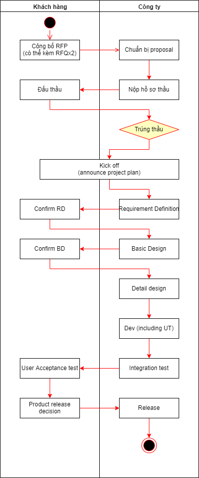

# Dự án từ đâu ra

Dự án có từ các nguồn:
1. Do một người/tổ chức nào đó giới thiệu. Cũng có thể do các bên môi giới giới thiệu.
2. Do đội sales đi tìm ra khách hàng (telesales, đăng quảng cáo...)
3. Do khách hàng tìm tới hỏi (trên trang web, link quảng cáo).

Có dự án khách hàng đã chốt luôn là làm với mình (do giới thiệu, hay chỉ định thầu...), nhưng cũng có dự án phải thông qua đấu thầu.
Dù là do giới thiệu thì cũng phải đưa ra đề án, và quan trọng nhất là dự toán. Nếu khách thấy giá cả OK, và có thể tin tưởng vào chất lượng của mình thì họ sẽ thuê mình làm.

Quy trình cơ bản của một dự án (làm theo water fall) như sau:

## RFP

RPF là viết tắt của Request for Proposal. Tạm dịch là hồ sơ mời thầu.
Trong ngành IT thì cứ tạm hiểu là những gì khách hàng muốn làm.

Nói một cách nghiêm ngặt thì RFP chỉ là tài liệu giới thiệu cái khách hàng muốn làm, là bước đầu tiên của việc mời thầu. Bên cạnh RFP còn có Request for Quotation (yêu cầu báo giá) hay Request for Qualifications (yêu cầu thông tin về năng lực của Agency). Trong ngành IT thì khi nói RFP thường bao bao gồm cả nghĩa RFQ.

    
Cấu trúc cơ bản của một RFP

    Tùy vào tính đặc thù của từng dự án, và yêu cầu của bên mời thầu mà những thông tin này có thể được thể hiện nhiều hoặc ít hơn các gạch đầu dòng sau
    * Thông tin cơ bản về công ty mời thầu
    * Thông tin cơ bản về nghiệp vụ đang cần làm hệ thống.
    * Thông tin cơ bản về hệ thống: Mục đích làm hệ thống, thời gian muốn đưa vào vận hành, bộ phận nghiệp vụ liên quan, số lượng người dùng...
    * Các mục tiêu cần đạt được khi đưa hệ thống vào sử dụng.
    * Các yêu cầu cơ bản về tính năng.
    * Các yêu cầu phi-tính năng.
    * Ngân sách
    * Vai trò, công việc của công ty tham gia đấu thầu: sẽ cung cấp, thực hiện những hạng mục nào trong số các hạng mục cần làm của hệ thống này.
    * Tiêu chuẩn để lựa chọn agency thắng thầu
    * Một số khách hàng, chương trình tiêu biểu/ tương tự mà agency/supplier đã làm
    * Lịch trình: thời hạn (deadline) gởi proposal, ngày present, ngày công bố agency thắng thầu, ngày ký hợp đồng…
    * Gởi proposal này cho ai, ở đâu
    * Nếu cần thêm thông tin thì liên hệ ai

    Viết lại dựa trên [RFP (request for proposal) là gì?](https://titanevent.vn/rfp-request-for-proposal-la-gi.html)

[RFP cho dự án "Hệ thống từ điển cho các dự án outsourcing"](RFP_vocabulary.md)

## Proposal

Khi nhận được yêu cầu về dự án, thường chúng ta phải làm một bản proposal, với nội dung chủ yếu sau:
* Tóm tắt các điểm quan trọng của proposal.
* Giới thiệu về công ty mình, năng lực, kinh nghiệm.
* Đưa ra các giải pháp trả giải quyết cho các vấn đề quan trọng đặt ra trong RFP.
* Đưa ra estimation (dự toán), schedule, tổ chức cho dự án.

Tất nhiên, các thông tin ở thời điểm này chỉ mang tính tương đối.
