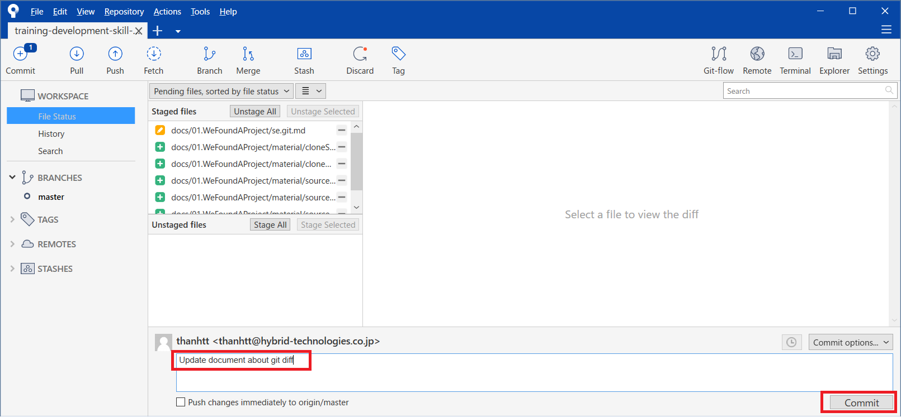
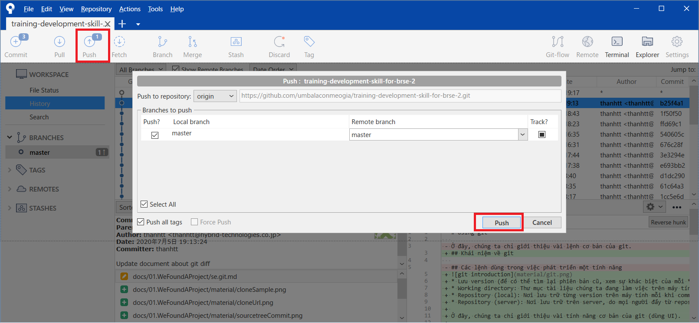

# Using git

## Khái niệm về git


* Lưu version (để có thể tìm lại phiên bản cũ, xem sự khác biệt của mỗi *commit*)
* Working directory: Thư mục tài liệu chúng ta đang làm việc trên máy tính.
* Repository (local): Nơi lưu trữ từng version trên máy tính mỗi khi commit.
* Repository (server): Nơi lưu trữ trên server, do mọi người đẩy từ repository (local) lên.

Buổi hôm nay, chỉ học khái niệm về các thao tác cơ bản (và dùng sourcetree UI)
* clone: Lần đầu tiên, kéo từ server về máy PC local.
* diff, stage: Đánh dấu các thay đổi sẽ được commit.
* commit: Lưu thay đổi vào repository (local).
* push: Đẩy thay đổi từ repository (local) lên repository (server).
* pull: Kéo thay đổi từ trên server về local.

## Các lệnh cơ bản

### Download dự án từ repository về máy local (clone)

1. Get clone URL
    <details>
      <summary>Get URL on github</summary>

    
    </details>

2. Run clone command
    ```shell
    git clone https://github.com/umbalaconmeogia/training-development-skill-for-brse-2.git
    ```
    <details>
      <summary>Clone result</summary>

      
    </details>

### Đánh dấu các thay đổi sẽ được commit (diff, stage)

<details>
  <summary>Diff</summary>

  
</details>
<details>
  <summary>Stage</summary>

  
</details>
<details>
  <summary>Stage again</summary>

  
</details>

### Commit code (commit)

<details>
  <summary>Commit</summary>

  
</details>
<details>
  <summary>After commit</summary>

  
</details>
<details>
  <summary>Chỉ commit trên local repository, trên server chưa thay đổi</summary>

  
</details>

### Đẩy lên repository (push)

<details>
  <summary>Push lên server</summary>

  
</details>
<details>
  <summary>Trong history có đánh dấu đã đẩy lên server</summary>

  
</details>
<details>
  <summary>Trên server có sự thay đổi</summary>

  
</details>

### Kéo về (pull)

<details>
  <summary>Trên server có sự thay đổi</summary>

  
  Trên local không đổi.
  
</details>


<hr />
Sau này sẽ học dần dần

### Phát hiện code được update (fetch)
Tham khảo trên [viblo](https://viblo.asia/p/nhung-dieu-khong-phai-ai-cung-noi-cho-ban-ve-git-part-1-1VgZvwkYlAw)

### Merge code (merge)

## Branch

### Create branch

### Checkout

## Release

### Create pull request

### Merge branch

## Tài liệu tham khảo

Lưu trữ ở đây để nghiên cứu dần dần, chứ không có nghĩa là tài liệu tôi đã chọn lọc.
* https://backlog.com/git-tutorial/vn/reference/
* https://viblo.asia/p/nhung-dieu-khong-phai-ai-cung-noi-cho-ban-ve-git-part-2-GrLZDXrBZk0
