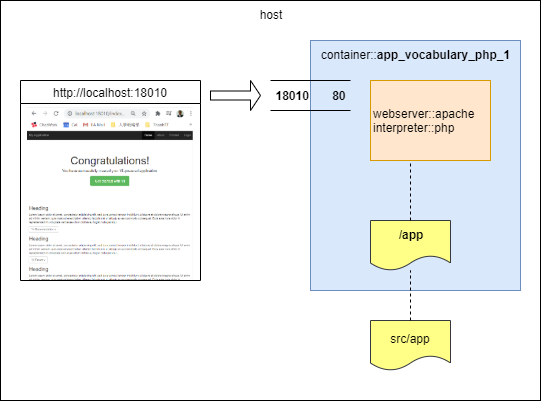

# Prepare dev environtment

## Run docker environtment

Về docker, các bạn tự tìm hiểu.

Chúng ta đã cài đặt docker trên máy host.
Giờ chúng ta chỉ cần biết cách chạy docker để có môi trường chạy dự án.

Mở shell tại thư mục app, chạy lệnh
```shell
docker-compose up -d
```

Đợi một chốc để docker download `image` `yiisoftware/yii2-php:7.1-apache`, tạo `container` `app_vocabulary_php_1` và khởi động nó.

Sau đó, chúng ta chỉ cần access vào URL http://localhost:18010

Tất cả những điều này được thực hiện do docker làm việc theo thiết lập trong [docker-compose.yml](../../src/app/docker-compose.yml)
```xml
version: '2'
services:
  vocabulary_php:
    image: yiisoftware/yii2-php:7.1-apache
    volumes:
      - ~/.composer-docker/cache:/root/.composer/cache:delegated
      - ./:/app:delegated
    ports:
      - '18010:80'
```

Khai báo này khiến docker tạo ra một kiến trúc như sau:



Reference: https://www.yiiframework.com/doc/guide/2.0/en/tutorial-docker

Ban đầu, chương trình sẽ bị báo lỗi do ta không set `cookieValidationKey`. Mở file `app/config/web.php` và set một giá trị bất kỳ cho nó.

Lúc này chương trình sẽ chạy, và cái ta nhìn thấy đầu tiên là


## Hãy thử nghịch một chút với yii2 application

### Màn hình responsive

* Thu nhỏ kích thước web browser, nó sẽ chuyển sang chế độ cho smartphone.
* Dùng web browser debugger (bấm phím F12), rồi chọn chế độ màn hình smartphone.


### Đổi tên application

Tên mặc định là `My Application`
* Đổi tên trong `app/config/web.php`

  Xem nội dung thay đổi code [ở đây](https://github.com/umbalaconmeogia/training-development-skill-for-brse-2/commit/9adfd0ce4c0148701a344f19d653fe019426c646#diff-4417df72dc0a3136040400927ecfa5daR10)

  ```php
  $config = [
      'id' => 'basic',
      'basePath' => dirname(__DIR__),
      'bootstrap' => ['log'],
      'name' => 'Project Term', // <= Set application name here
      'aliases' => [
          '@bower' => '@vendor/bower-asset',
          '@npm'   => '@vendor/npm-asset',
      ],
      // Other config
  ],
  ```
  
* Đổi text trong footer trong file `app/views/layouts/main.php`.

  Xem nội dung thay đổi code [ở đây](https://github.com/umbalaconmeogia/training-development-skill-for-brse-2/commit/9adfd0ce4c0148701a344f19d653fe019426c646#diff-1dc80ad43ca49b41fb43d54a0042e629R72)

  Code cũ
  ```php
  <footer class="footer">
      <div class="container">
          <p class="pull-left">&copy; My Company <?= date('Y') ?></p>

          <p class="pull-right"><?= Yii::powered() ?></p>
      </div>
  </footer>
  ```
  Code mới
  ```php
  <footer class="footer">
      <div class="container">
          <p class="pull-left">&copy; <?= Yii::$app->name ?> <?= date('Y') ?></p>

          <p class="pull-right"><?= Yii::powered() ?></p>
      </div>
  </footer>
  ```
  

### Thay đổi menu trong file `app/views/layout/main.php`

Ẩn menu item `Home`, `About`.

Xem nội dung thay đổi code [ở đây](https://github.com/umbalaconmeogia/training-development-skill-for-brse-2/commit/9adfd0ce4c0148701a344f19d653fe019426c646#diff-1dc80ad43ca49b41fb43d54a0042e629R41)

```php
    echo Nav::widget([
        'options' => ['class' => 'navbar-nav navbar-right'],
        'items' => [
//            ['label' => 'Home', 'url' => ['/site/index']],
//            ['label' => 'About', 'url' => ['/site/about']],
            ['label' => 'Contact', 'url' => ['/site/contact']],
```

### Đổi nội dung trang top trong `app/views/site/index.php`

Xóa hết sample text ở trang top (site/index).

Nội dung thay đổi code [ở đây](https://github.com/umbalaconmeogia/training-development-skill-for-brse-2/commit/9adfd0ce4c0148701a344f19d653fe019426c646#diff-ecf7e706799b158fdbe2525fde943d6e)

```php
<?php

/* @var $this yii\web\View */

$this->title = 'My Yii Application';
?>
<div class="site-index">

    <div class="jumbotron">
        <h1><?= Yii::$app->name ?></h1>

        <p class="lead">You have successfully created your Yii-powered application.</p>
    </div>

</div>
```
