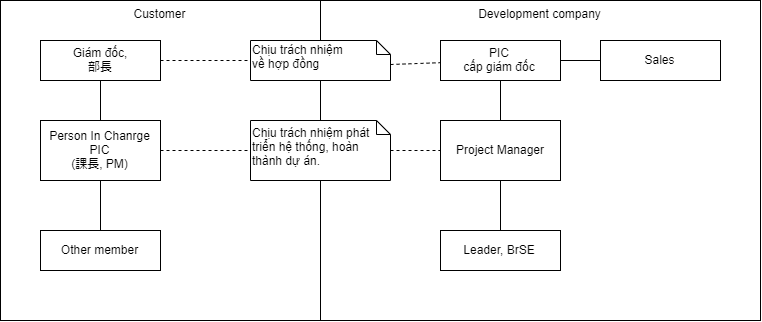

# Project kickoff meeting

Sau khi khách hàng quyết định giao dự án cho công ty, việc đầu tiên cần làm là tổ chức kick off meeting.

Đây xem như buổi họp đầu tiên tuyên bố dự án được khởi động. Thường nó sẽ được tổ chức trong vòng 1 tuần kể từ khi khách hàng quyết định giao dự án cho công ty.

## Mục đích

Kickoff meeting để giới thiệu thành phần member liên quan đến dự án của hai bên: khách hàng và đội phát triển. Trong buổi họp này, các bên cũng thống nhất rất nhiều điều liên quan đến thực hiện dự án, ví dụ như:
* Tổ chức của dự án (ai tham gia dự án với vai trò gì, có nhiệm vụ gì)
* Schedule dự án.
* Yêu cầu về input/output.
* Quy trình, cách thức liên lạc, báo cáo, xử lý trouble...

Tất cả những điều này được thể hiện trong *Project Plan*, là tài liệu mà Project Manager của đội phát triển phải trình ra trong buổi họp kickoff meeting, và sẽ được 2 phía khách hàng và đội phát triển approve. Sau này mọi tranh cãi về việc thực hiện dự án, hầu như sẽ phải tham chiếu đến Project Plan để quyết định ai đã làm đúng/sai.

## Thành phần tham gia kickoff meeting

Buổi họp này gồm có sự tham gia của những người chủ chốt phía khách hàng và công ty.
* Phía khách hàng gồm có
  * Người chịu trách nhiệm chính về dự án bên khách hàng (như PM, Product owner).
  * Những người hỗ trợ dự án phía khách hàng (support cho người chịu trách nhiệm chính).
  * Cấp trên của người chịu trách nhiệm chính (trưởng phòng, giám đốc).
* Phía công ty phát triển gồm có
  * Người chịu trách nhiệm chính (thường là giám đốc/phó giám đốc bộ phận), sales.
  * Project Manager
  * Leader, BrSE.

Tương quan về vị trí của những người có mặt trong buổi kick off meeting như sau

## Project plan

Xem tài liệu project plan của dự án này [ở đây](projectPlan.pdf)