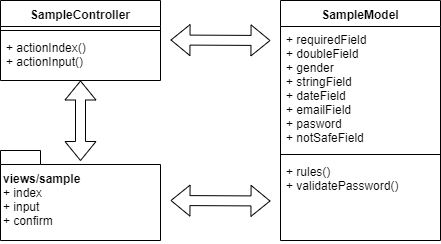
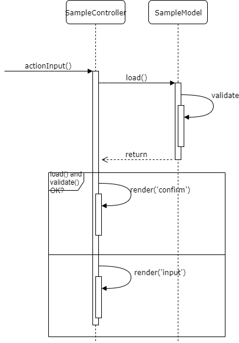

# Working with form

## Overview

Hôm nay học kỹ hơn về MVC, form.

* Flow MVC
* Cách viết HTML tag bằng class *Html*
* Cách viết HTML form bằng *ActiveForm*
* Demo về các validator
* Cơ chế validation
* Giải thích massive assign.
* Lệnh print_r(), log, die

Ví dụ sử dụng hôm nay bao gồm model *SampleModel*, *SampleController* và các views nằm trong *views/sample*.

## Flow MVC

Ta có 2 action của SampleController

* actionIndex(): Về cơ bản không xử lý gì, chỉ hiển thị ra trang index (link tới form input).
* actionInput(): Xử lý form input để nhập data, hiển thị trang confirm, và xử lý kết quả sau confirm.

## Trang index

Ở đây ta không xử lý gì đặc biệt, chỉ hiển thị view index.
Trong sample này, ta học vài lệnh PHP và yii.
* Hiển thị bằng lệnh echo và tag `<?=`
* Viết tag HTML thuần túy, hay dùng class *Html*
  * Dùng class *Html*, ta có thể tạo ra các tag Html lồng nhau có kiến trúc cũng như xử lý logic phức tạp hơn.
  Html::tag()
  Html::a()

## Trang input, confirm, register

### Cách viết tag HTML bằng ActiveForm

Ta có thể dùng Html::input() để tạo ra `<input type="text" name="anyField">`.

Object *ActiveForm* có thể làm được nhiều việc hơn
* Hiển thị label
* Hiển thị error
* Đặt tên field để tạo ra param array (dùng cho massive assign).
* Tạo các dropdown, radio list, checkbox list. Giống như ở trên đã nói, có thể thực hiện các kiến trúc phức tạp hơn.

### Demo về các validator

### Cơ chế validation

* Bắt buộc phải validate ở background.
* Validate ở GUI để tăng thêm user experience.

