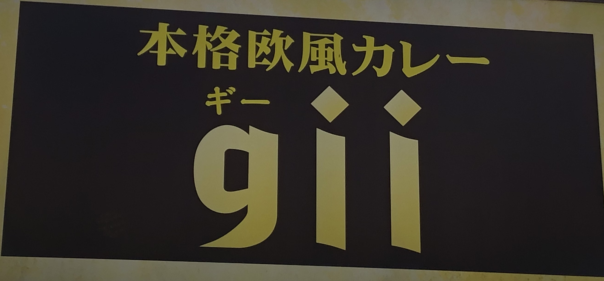

# Generating code with Gii

## Mục đích của bài hôm nay

Bài hôm nay không có nội dung về process, mà tập trung vào việc tạo model, controller, view với database đã được thiết kế.

* Tạo migration cho các table khác.
* Tạo models
* Tạo CRUD
* Giải thích về relation
* Giải thích về property

Nội dung được trình bày trong [phần kỹ thuật](se.gii.md).