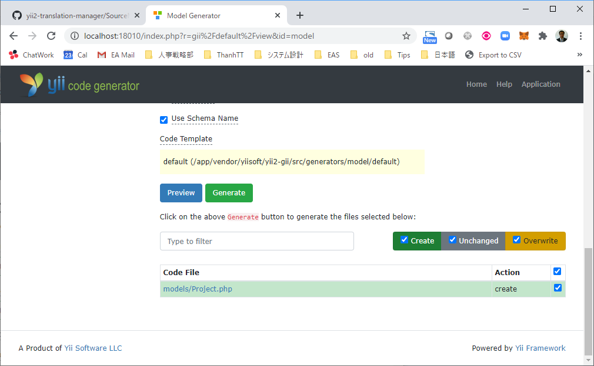

# Tạo model và CRUD

## Nhắc lại một chút về docker

* Khởi động docker
  ```shell
  docker-compose up --build -d
  ```
* Vào môi trường bash của web server
    ```shell
    docker exec -it project_term_web bash
    ```
    For Windows
    ```shell
    winpty docker exec -it project_term_web bash
    ```

## ERD


## Tạo migration cho các table khác

* Tạo migration files.
    ```shell
    php yii migrate/create create_business_table
    php yii migrate/create create_project_user_table
    php yii migrate/create create_project_business_table
    ```
* Quy ước đặt tên foreign key constrain
    `<table name>-<foreign key column>-key`

## Tạo model

* Access vào tính năng gii
  * URL: http://localhost:18010/index.php?r=gii
  * Tạo tắt tính năng security (allow all IP) trong file `config/web.php`
    ```php
    $config['modules']['gii'] = [
        'class' => 'yii\gii\Module',
        'allowedIPs' => ['*'],
    ];
    ```
  
* Model Generator
  
  
  Click button `Generate`
* Tương tự, tạo model cho các table còn lại (trừ table user).
  * Table `term`
  * Table `business`
  * Table `project_user`
  * Table `project_business`

## Tạo CRUD


Click button `Generate`.

Access thử vào tính năng vừa tạo

URL: http://localhost:18010/index.php?r=project

Thử create, view, index, delete (CRUD) với project.

Giải thích về controller và view đã được tạo ra

Chưa sờ đến model ProjectSearch ở đây. Nó rất thú vị và có quá nhiều thứ để nói, nên sẽ nói riêng.

## Tạo thêm các CRUD khác

Crud cho Term, cần phải chỉnh lại view index, view cho nó.

## Giải  thích về relation

* Trong list của term, hiển thị thông tin về project của nó.
* Giải thích về property (có thể là attribute, cũng có thể là relation).
* Giải thích về getter và setter.