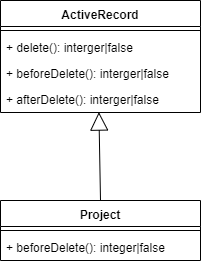

# Hiểu sâu hơn về ActiveRecord

## Overview

Ở bài trước, chúng ta đã sử dụng gii để tạo ra các model, CRUD.

Chính xác thì các model đó là các ActiveRecord.

Trong bài này, chúng ta sẽ tìm hiểu sâu hơn về ActiveRecord và các kỹ thuật liên quan.
* Khái niệm về ActiveRecord
* Relation
* Search model class.
* Tip
  * DRY
  * Function override
  * 2 cách xóa term

## ActiveRecord

ActiveRecord là cách dùng object để access vào data trong DB.

Nếu muốn thì mọi người có thể tìm hiểu thêm về [ORM và AR](https://itzone.com.vn/vi/article/khai-niem-co-ban-khong-the-khong-biet-ve-active-record-active-record-basic/), còn ở đây chúng ta chủ yếu đi thẳng vào cách dùng AR.

Trước khi có khái niệm AR, chúng ta thường phải query data từ DB bằng câu lệnh SQL, rồi lấy ra các column data cần thiết từ kết quả query. Tương tự với việc update, delete.

Ví dụ đoạn code sau để query toàn bộ các project và xử lý trên từng record.
```php
$sql = 'SELECT * FROM project;';
$result = Yii::$app->db->createCommand($sql)->queryAll();
foreach ($result as $projectArr) {
    echo 'Project name: ' . $projectArr['name'] . ', remarks: ' . $projectArr['remarks'] . '<br />';
};
```
Câu lệnh trên sẽ cho ra kết quả như sau (có thể access vào http://localhost:18010/index.php?r=project/query-all để xem)
```
Project name: 参観データ管理, remarks: 会社の見学者データ管理システム
Project name: ECサイト構築, remarks: ABC顧客のECモールシステム開発
```

Như vậy việc xử lý với database sẽ là một chuỗi của các công việc *tạo SQL query, run query, fetch* kết quả trả về. Việc này rất cực nhọc và nhàm chán.

Sử dụng AR, sẽ có lợi sau:
* Phần lớn công việc *tạo SQL query, run query, fetch* chúng ta không phải làm (hoặc làm rất ít, chủ yếu là ở mức tạo SQL query nếu nó phức tạp).
* Chúng ta có thể access database record thông qua object một cách tự nhiên.

Cùng công việc như trên
```php
$projects = Project::find()->all();
foreach ($projects as $project) {
    echo "Project name: {$project->name}, remarks: {$project->remarks}<br />";
}
```

Kết quả là như nhau, xem ví dụ output tại http://localhost:18010/index.php?r=project/find-all

Ví dụ này tương đối đơn giản, nên chúng ta chưa thấy được sự khác biệt rõ rệt (nhất là đôi khi chỉ nhìn thấy sự khác nhau ở chỗ thay vị access vào array thì chúng ta access vào object instance variable). Tuy nhiên cần để ý là:
* Chúng ta không phải viết ra câu lệnh SQL (nên không lo các vấn đề như escape data, lỗi security sql injection...). Thực sụ mà nói thì hiện giờ không nhiều developer biết viết câu lệnh SQL :D
* AR không chỉ đơn thuần giúp chúng ta chạy câu lệnh SQL. Vì nó là object class, nên nó cung cấp rất nhiều cơ chế giúp chúng ta xử lý data lấy về (chúng ta có thể viết các đoạn code xử lý data lấy về, viết các getter/setter, access vào các relational data). Túm lại là chúng ta có thể làm mọi thứ với một *object*, chứ không chỉ là việc chạy câu lệnh SQL và lấy kết quả nó trả về.

Để có thể access vào ActiveRecord, đương nhiên chúng ta phải có một class tương ứng cho nó, cụ thể ở đây là class [Project](https://github.com/umbalaconmeogia/training-development-skill-for-brse-2/blob/master/src/app/models/Project.php).
Class này kế thừa class *\yii\db\ActiveRecord*, cho nên nó được cung cấp rất nhiều tính năng sẵn có.
* Access vào các column của từng record thông qua các property như id, name, remarks.
* Các câu lệnh find (tương đương với SELECT), update, delete, đương nhiên có thể tạo mới record. Tất cả đều thông qua *object way*, chúng ta làm việc với chúng như là các PHP object, mà không cần có khái niệm gì về SQL.
* Và nhiều khái niệm khác như relation, behavior...

## Relation

Trong project, chúng ta khai báo quan hệ 1-n giữa Project và Term như sau:
```php
public function getTerms()
{
    return $this->hasMany(Term::class, ['project_id' => 'id']);
}
```
Chỉ cần như vậy, là ta có thể tìm tìm kiếm và truy cập vào toàn bộ các term của một project nào đó chỉ bằng property `$project->terms`
Ví dụ như với action project/terms(http://localhost:18010/index.php?r=project%2Fterms&id=1):
```php
$project = Project::findOne($id);
foreach ($project->terms as $term) {
    echo "Language: {$term->language}, vocabulary: {$term->vocabulary}, description: {$term->description}, type: {$term->type}<br />";
}
```
Output
```
Language: ja, vocabulary: 決済, description: お金を支払うこと, type: 1
Language: vi, vocabulary: Thanh toán, description: Trả tiền, type: 1
Language: ja, vocabulary: クレジットカード, description: 支払方法の一つ, type: 1
Language: vi, vocabulary: Credit card, description: Một hình thức thanh toán, type: 1
```

## Search model class

Ở màn hình project/index (http://localhost:18010/index.php?r=project%2Findex), chúng ta làm được rất nhiều việc:
* Hiển thị danh sách các project
* Filter
* Thêm các action button để view/edit/delete.

Data được hiển thị trong table (GridView). GridView sử dụng DataProvider để cung cấp data cho từng row.
DataProvider cũng không phải là cái gì đặc biệt, nó chỉ là một interface dùng để truy xuất từng phần tử data trong một tập hợp data. Cụ thể ở đây là truy xuất từng ActiveRecord trong một array of AcrtiveRecord.

Tại sao lại dùng cái gì mà DataProvider interface, mà không loop một vòng for cho nó đơn giản :D
Như đã từng giải thích trước đây, khi việc lập trình được nâng lên một tầng trừu tượng hóa, thì nó có thể đối ứng được với các hình thức data đa dạng hơn.
Dùng DataProvider để cung cấp data cho GridView, sẽ cho phép GridView có thể làm việc với array of AR (object), cũng có thể làm việc với array of array, hoặc bất kỳ dạng data nào khác. Khi có cơ hội chúng ta sẽ để cập sâu hơn tới vấn đề này.

Trong trường hợp này, cụ thể là chúng ta dùng ActiveDataProvider. DataProvider hiểu đơn giản chỉ là một PHP object, chứa một tập hợp các Project objects (ActiveRecord) mà chúng ta cần để cung cấp cho GridView hiển thị lên màn hình.

Tập hợp các Project objects này được cung cấp qua hàm search() của search model class *ProjectSearch*
```php
public function actionIndex()
{
    $searchModel = new ProjectSearch();
    $dataProvider = $searchModel->search(Yii::$app->request->queryParams);
    // Other stuff.
}
```

*ProjectSearch* không phải là một class đặc biệt gì cả. Chúng ta tạo ra một class tên là *ProjectSearch* để nhấn mạnh nó chứa các đoạn code tìm kiếm liên quan đến table *project*. Điều quan trọng ở đây là function *search()* của class này, nó trả về một DataProvider tìm kiếm các Project theo điều kiện được chỉ định.
Điều kiện tìm kiếm này được truyền tới thông qua *Yii::$app->request->queryParams* trong câu lệnh trên.

### Giải thích sâu về code của hàm search()
Các tham số tìm kiếm Project, nếu được chỉ định trong params, thì sẽ được đưa vào điều kiện tìm kiếm.
Nếu không được chỉ định, thì sẽ không được đưa vào điều kiện tìm kiếm.
```php
class ProjectSearch extends Project
{
    /**
     * $param array $params array sẽ có một key là ProjectSearch, chứa các điều kiện filter.
     */
    public function search($params)
    {
        // Load các điều kiện filter được chỉ định trong $params['ProjectSearch']
        // Lệnh này sẽ load $params['ProjectSearch']['id'] vào $this->id
        // Lệnh này sẽ load $params['ProjectSearch']['name'] vào $this->name
        // Lệnh này sẽ load $params['ProjectSearch']['remarks'] vào $this->remarks
        $this->load($params);

        $query = Project::find(); // Tạo ra một ActiveQuery

        // Nếu id được chỉ định trong $params, thì câu lệnh SQL sẽ có điều kiện WHERE id = :id
        $query->andFilterWhere([
            'id' => $this->id,
        ]);

        // Nếu name được chỉ định trong $params, thì câu lệnh SQL sẽ có điều kiện WHERE name ilike %NAME%
        // ở đây NAME hiểu là data được chỉ định trong filter.
        $query->andFilterWhere(['ilike', 'name', $this->name]);
        // Nếu remakrs được chỉ định trong $params, thì câu lệnh SQL sẽ có điều kiện WHERE remarks ilike %REMAKRS%
        // ở đây REMARKS hiểu là data được chỉ định trong filter.
        $query->andFilterWhere(['ilike', 'remarks', $this->remarks]);

        // Tạo ra một DataProvider sẽ tìm kiếm data theo query được chỉ định
        // DataProvider sẽ gọi câu lệnh query này để lấy về các Project objects theo điều kiện tìm kiếm.
        $dataProvider = new ActiveDataProvider([
            'query' => $query,
        ]);

        return $dataProvider;
    }
}
```
Ở trên đã sắp xếp lại thứ tự các câu lệnh trong function *search()* cho dễ hiểu hơn, tác dụng của nó vẫn không thay đổi so với code thật.

DEMO việc tìm kiếm bằng SQL log.

## DRY

DRY là DON'T REPEAT YOURSELF.
Nhựng đoạn code cùng xử lý một việc giống nhau, thì chúng ta phải cho nó vào trong class/function để tái sử dụng, đừng

Chúng ta sẽ demo khái niệm DRY thông qua quá trình hiển thị/edit thông tin Term#type

term#type có 2 trạng thái
1: Term chính thức của dự án (từ vựng của dự án, thống nhất với khách hàng).
2: Term do BrSE, comtor thêm vào để bổ sung thêm cho anh em VN trong dự án hiểu rõ hơn.

Để hiển thị Term#type trên màn hình
* edit/view: chúng ta tạo property Term#typeStr (thông qua function Term#getTypeStr()).
* create/update và filter trong index: chúng ta tạo function Term::typeOptionArr().

## Function override

(Cái này chỉ để demo một khái niệm của OOP)

Khi xóa một project, chúng ta sẽ muốn xóa luôn toàn bộ các term của project đó.

Trước khi xóa project (bằng cách gọi Project#delete()), chúng ta gọi lệnh delete trên các Term thuộc về project đó.

Ta thực hiện việc đó bằng cách định nghĩa function *Project#beforeDelete()*
```php
class Project
{
    /**
     * Delete all child terms before delete this one.
     */
    function beforeDelete()
    {
        // Delete all term (that does not have parent term)
        foreach ($this->terms as $term) {
            if (!$term->parent_term_id) {
                $term->delete();
            }
        }
        return parent::beforeDelete();
    }
}
```
Trong function Project#delete(), nó có gọi function beforeDelete() [source code](https://github.com/yiisoft/yii2/blob/master/framework/db/BaseActiveRecord.php#L884).



Chú ý là trong lệnh Project#beforeDelete(), chúng ta chỉ gọi lệnh Term#delete() trên các term không có parent_term_id
(là các term tiếng Nhật).
Còn trong Term#beforeDelete(), chúng ta gọi lệnh xóa toàn bộ các child Term trước khi xóa một Term tiếng Nhật.
```php
class Term
{
    /**
     * Delete all child terms before delete this one.
     */
    function beforeDelete()
    {
        foreach ($this->childTerms as $term) {
            $term->delete();
        }
        return parent::beforeDelete();
    }

}
```

## 2 cách xóa term

Ngoài cách sử dụng behavior ở trên, chúng ta có thể override luôn function delete() của Project. Thậm chí có nhiều cách để làm việc này.
* Cách 1
    ```php
    class Project
    {
        function delete()
        {
            foreach ($this->terms as $term) {
                if (!$term->parent_term_id) {
                    $term->delete();
                }
            }
            parent::delete();
        }
    }
    ```
* Cách 2
    ```php
    function delete()
    {
        Term::deleteAll(['project_id' => $this->id]);
        parent::delete();
    }
    ```

Cách 1 ở trên tạo ra nhiều câu lệnh SQL *DELETE term* (tùy thuộc vào số lượng term của project). Ví dụ
```sql
DELETE FROM "term" WHERE "id"=4
DELETE FROM "term" WHERE "id"=2
DELETE FROM "term" WHERE "id"=3
DELETE FROM "term" WHERE "id"=1
DELETE FROM "project" WHERE "id"=1
```

Cách 2 ở trên tạo ra duy nhất 1 câu lệnh SQL *DELETE term*.
```sql
DELETE FROM "term" WHERE "project_id"=5
DELETE FROM "project" WHERE "id"=5
```

Không thể nói là cách nào tốt hơn cách nào.

Cách 2 nhanh hơn về mặt hiệu suất. Nhưng cách 1 cho phép gọi thêm nhiều xử lý liên quan đến delete một object Term (cũng như khi ta delete một Project, ta muốn xóa toàn bộ các Term của project đó chẳng hạn).
Trên quan điểm OOP thì ta muốn sử dụng cách 1 (logic thống nhất, ít xảy ra lỗi do bị sót logic như cách 2...). Tuy nhiên đôi khi với những xử lý quan trọng về mặt hiệu suất, ta có thể phải xem xét sử dụng cách 2.