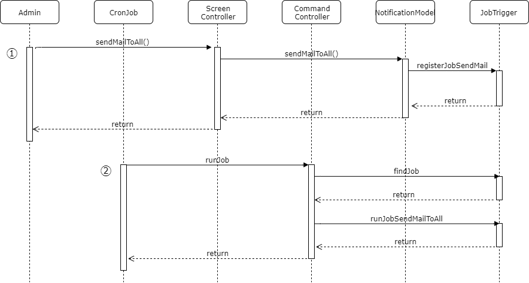

# Querying data

Buổi hôm nay cũng thiên về nội dung kỹ thuật.
* Command line.
* Querying data.
* Đằng sau relation function.
* Relation via junctional table.
* Lazy loading and eager loading.

## Command line

Command line dùng để viết các câu lệnh chạy trên `command line` :p
Command line thường dùng để:
* Chạy các tác vụ background (chạy vào thời điểm được chỉ định, thông qua các trình `cronbjob` hoặc `schedule`).
  Ví dụ như tính doanh thu hàng ngày, tính lương hàng tháng, gọi API chuyển lương, xóa data rác, backup data.
* Xử lý các công việc không chạy trên màn hình (thường do người vận hành hệ thống xử lý).
  Ví dụ như thêm user có quyền super admin (thường là user đầu tiên của hệ thống), import số lượng lớn data từ file...
* Ngoài ra, do hạn chế của thời gian access tính năng trên web (thường phải return trong vòng 30s), nên tác vụ xử lý nặng ta sẽ chuyển sang tính năng background.
  <details>
    <summary>Ví dụ: Tính năng gửi mail sendMailToAll()</summary>

    Tính năng gửi mail là tác vụ rất nặng. Ví dụ khi phải connect vào mail server, rồi mới ra yêu cầu gửi mail mail theo protocol SMTP, giả sử để gửi 1 email thì tốn 1 giây, thì gửi mail cho 300 người tốn 5 phút, chạy trên màn hình sẽ bị lỗi timeout.
    Cho nên thường tác vụ gửi mail sẽ được xử lý như sau:
    1. Trên màn hình, admin ra lệnh gửi mail cho mọi người. Hệ thống sẽ đăng ký lệnh này vào trong DB (ví dụ vào table job_trigger). Sau đó return lại màn hình admin. Tác vụ này chỉ mất 2, 3 giây.
    2. Sẽ có một cronjob định kỳ chạy 3 phút một lần, mỗi lần sẽ check xem trong table job_trigger có đăng ký job nào chưa được xử lý hay không. Nếu có thì nó gọi xử lý job này. Lệnh gửi mail ở trên sẽ được xử lý như vậy, và chạy ở command line nên không bị giới hạn về thời gian.
    
  </details>

Việc tạo một command line cũng giống như viết một web Controller.

Chúng ta sẽ tạo một command line Controller làm nhiệm vụ tạo data test.
Chạy lệnh bằng cú pháp sau
```shell
php yii test/generate-project-and-term
```

Một số điểm lưu ý trong code:
* Command line controller cũng tương tự như web controller (khác đầu vào là command line thay vì web).
* Cách tách function `registerTerm()` ra ngoài `registerProjectAndTerms()`.
* Có lệnh này rồi ta có thể thoải mái nghịch phá data và có thể khôi phục lại dễ dàng.

## Querying data

Thử với các lệnh
* findOne()
* findAll()
* find(), one(), all(),
* where()
* orderBy()

## Đằng sau relation function

Xem log SQL.

## Relation via junctional table.

## Lazy loading and eager loading.

## Bai sau
* Getter/setter: yii magic.

