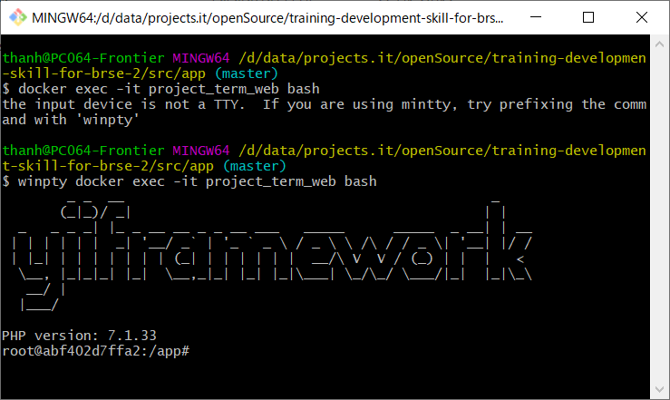
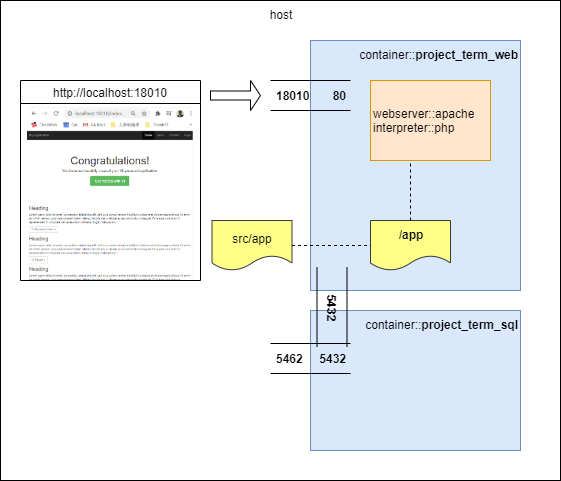
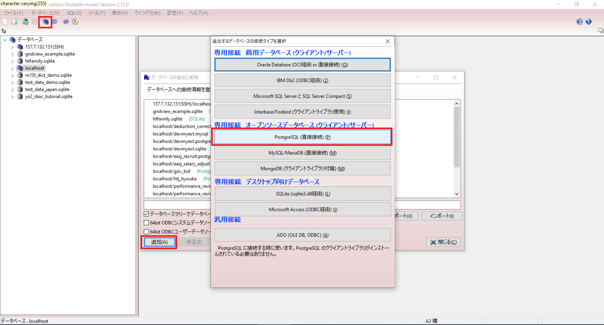
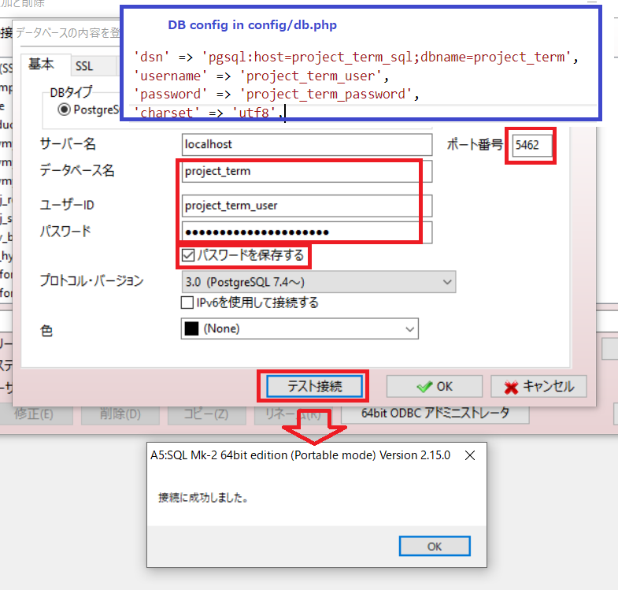
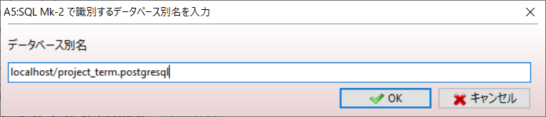
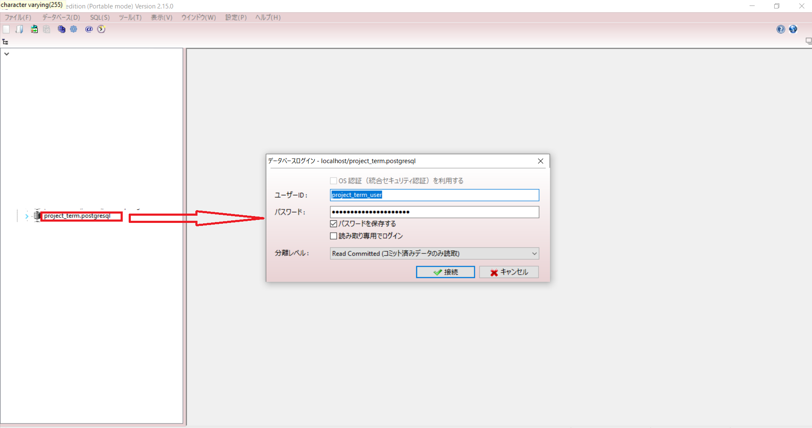
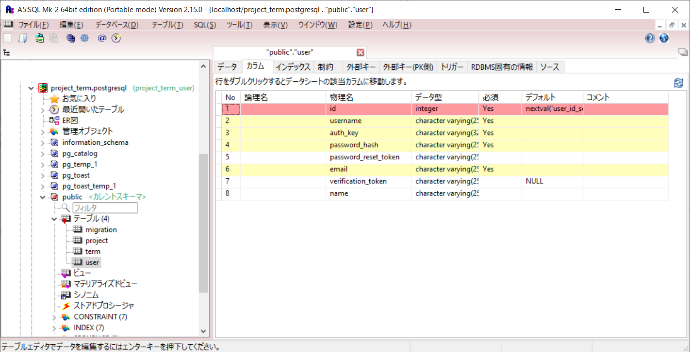
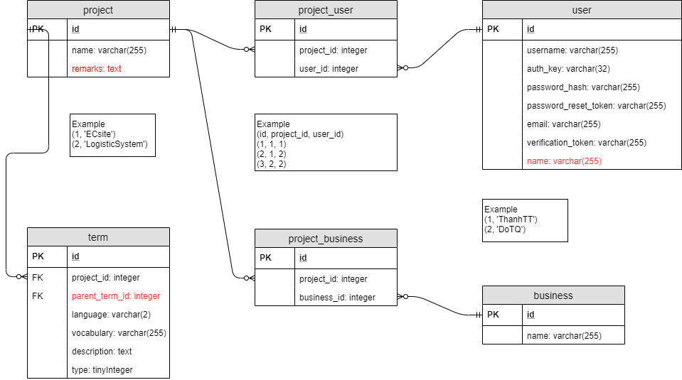

# Database migration

## 1. Tại sao dùng migration

* Sử dụng PHP code để chạy lệnh SQL => không đòi hỏi phải biết sâu về SQL.
  Điều này rất quan trọng để giúp developer tạo môi trường phát triển trên máy local.
* Các developer có thể dễ dàng update môi trường khi có sự thay đổi schema.
* Tương thích với nhiều loại database (trong một giới hạn cho phép).

## 2. Access to docker bash

```shell
docker exec -it project_term_web bash
```

For Windows
```shell
winpty docker exec -it project_term_web bash
```


## 3. migrate/create

```shell
php yii migrate/create create_user_table
php yii migrate/create create_project_table
php yii migrate/create create_term_table
```

## 4. Log

* Xem log sql trong *runtimes/logs/sql.log*
* Config log trong *config/console.php* và *config/web.php*
```php
'log' => [
    'targets' => [
        [
            'class' => 'yii\log\FileTarget',
            'levels' => ['error', 'warning', 'info', 'trace'],
            'logVars' => [],
            'except' => ['yii\db\*'],
        ],
        [
            'class' => 'yii\log\FileTarget',
            'levels' => ['error', 'warning', 'info', 'trace'],
            'logVars' => [],
            'categories' => ['yii\db\*'],
            'logFile' => '@app/runtime/logs/sql.log',
        ],
    ],
],
```

## 5. Connect to PostgreSQL from local

* Connect to localhost:5462
    <details>
        <summary>Cấu trúc docker</summary>

    
    </details>

    <details>
        <summary>Config A5:SQL Mk2</summary>

    * Tạo connection tới Postgres
      
    * Test connection tới Postgres
      
    * Save connection tới Postgres
      
    * Kết nối tới Postgres
      
    * Sau khi kết nối
      
    </details>


## 6. migrate/up

```shell
php yii migrate/up
```

## 7. migrate/down

Down 1 level
```shell
php yii migrate/down
```

Down toàn bộ
```shell
php yii migrate/down all
```

## Chú ý

* `migrate/down` chủ yếu dùng khi đang develop migration. Trên product server hầu như không bao giờ dùng migrate/down.
* Không sửa lại code của file migration khi đã push lên git reposigory (trừ một vài trường hợp bất khả kháng).
* Khi chạy migrate trên server (product, stagging), luôn backup database trước khi chạy lệnh migrate.

### 8. Add column migration

```shell
php yii migrate/create add_name_column_on_user_table
php yii migrate/create add_remarks_column_on_project_table
php yii migrate/create add_parent_term_id_column_on_term_table
```
