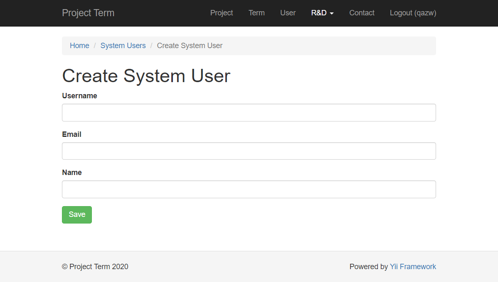

# Implement Login

Bài hôm nay sẽ trình bày cách implement một số cách implement tính năng login.
* Lưu thông tin login vào DB
* OAuth2

## Ôn lại bài cũ

Ở [bài trước](../07.Login/README.md) chúng ta đã thử với tính năng login bằng username và password.

Với code đầu tiên của model class *User*, chúng ta có 2 vấn đề:
1. Password lưu dưới dạng plain text.
2. Password được hard coding vào trong class User.

Chúng ta đã khắc phục vấn đề 1 bằng cách thay vì lưu plain password, thì chuyển sang lưu pasword hash.

Vấn đề 2 cũng có thể được khắc phục bằng cách chuyển thông tin về user vào một file nằm ngoài thư mục chương trình.

Tuy nhiên, cách này cũng sẽ khó cho việc vận hành.

Hôm nay chúng ta sẽ cải tiến phương pháp login bằng cách:
1. Lưu thông tin login vào DB.
2. Học thêm cách sử dụng hệ thống login bên ngoài (cụ thể là google ID).

## Lưu thông tin login vào DB

Trong DB migration, chúng ta đã tạo table user, dùng để lưu thông tin login (username, password hash). Tuy nhiên vẫn chưa sử dụng đến nó.

Hôm nay ta sẽ tạo model class SystemUser tương ứng với table này.

Ta đã có model class *User*. Ta có thể xóa nội dung cũ của file này đi, ghi đè nội dung mới vào. Tuy nhiên để tiện lưu lại cho các bạn tham khảo sau này (và có lí do để học thêm vài kỹ năng khác), chúng ta sẽ không xóa class User cũ. Thay vào đó, chúng ta sẽ:
1. Đổi tên table *user* trong database thành *system_user*.
2. Tạo model class *SystemUser*.
3. Tạo CRUD cho SystemUser (dùng để quản lý SystemUser).

Trong qúa trình implement class *SystemUser*, chúng ta sẽ có cơ hội ôn lại vài khái niệm đã học
1. Config một component.
2. Implement interface.
3. Getter và setter.

Nếu mọi người sử dụng code mới nhất của bài học hôm nay, thì cách thao tác sẽ hơi khác với thứ tự bài giảng. Các thao tác chúng ta cần làm là:
1. Get code mới nhất về bằng lệnh `git pull`.
2. Chạy `php yii migrate/up` để đổi tên table `user` thành `system_user`.
3. Chạy lệnh `php yii user/create-user <username> <email> <password> để tạo ra user đầu tiên trong `system_user`.
4. Dùng user đó để login vào hệ thống.

### Đổi tên table *user* thành *system_user*

Tạo file migration
```shell
php yii migrate/create rename_table_user_to_system_user
```

<details>
  <summary>Nội dung file migration</summary>

  ```php
    class m201011_083305_rename_table_user_to_system_user extends Migration
    {
        public function safeUp()
        {
            $this->renameTable('user', 'system_user');
        }

        public function safeDown()
        {
            $this->renameTable('system_user', 'user');
        }
    }
  ```
</details>

Run migration
```shell
php yii migrate
```

### Tạo CRUD cho SystemUser

Sau khi tạo CRUD và sửa một chút các view (theo cách chúng ta đã làm với các DB table khác, là chỉ hiển thị các field chúng ta cần lên màn hình), ta có bộ CRUD cơ bản với table system_user.

### Set password

Ta có màn hình create System User như sau:


Lưu ý là chúng ta không lưu password vào trong DB, mà chỉ lưu hash code của password.
Nhưng chúng ta cần một chỗ để lưu password nhập từ người dùng (admin), chuyển nó thành password_hash để lưu vào DB.
Để làm việc này, chúng ta dùng đến getter và setter.

Chú ý rằng khái niệm getter và setter là khái niệm chung và phổ biến trong lập trình (trong java thì nó đơn giản hơn, chỉ đơn giản là ta giấu (make private) các instance variable, chỉ cho phép access qua getter và setter function. Trong các framework PHP và RoR, getter và setter cũng có ý nghĩa như vậy, ngoài ra nó mạnh mẽ hơn nhờ tận dùng sức mạnh của các ngôn ngữ này (cho nên việc tìm hiểu getter và setter của Yii framework, vừa giúp ta học được nội dung mang tính phổ quát, vừa học được đặc thù của ngôn ngữ script, điều giúp chúng ta khi tiếp cận với ngôn ngữ khác).

Vì ta muốn nhập *password* trên màn hình như cách nhập các thông tin khác, nên ta khai báo để SystemUser có một property tên là *password*.
Trong trường hợp này, chúng ta sẽ tạo function setPassword(), và khai báo *password* là một *safe* attribute, để nó có thể được massive assigned (cách thường dùng để gán data được nhập từ màn hình thông qua hàm *$model->load(Yii::$app->request->post)* quen thuộc).

Với setPassword($password), ta sẽ convert password sang password_hash để lưu vào DB.
```php
    public function setPassword($password)
    {
        if ($password) {
            $this->password_hash = Yii::$app->security->generatePasswordHash($password);
        }
    }
```

Khai báo *password* là safe attribute
```php
    public function rules()
    {
        return [
            ['password', 'safe'],
            // Other stuffs
        ];
    }
```

### Implement IdentityInterface

Để có thể sử dụng SystemUser với logic login của Yii2, ta cần cho SystemUser implement IdentityInterface (implement 5 function)
 * findIdentity()
 * findIdentityByAccessToken()
 * getAuthKey()
 * getId()
 * validateAuthKey()

<details>
    <summary>Implement IdentityInterface</summary>

    ```php
    class SystemUser extends \yii\db\ActiveRecord implements IdentityInterface
    {
        /**
        * {@inheritdoc}
        */
        public static function findIdentity($id)
        {
            return static::find()->where(['id' => $id])->one();
        }

        /**
        * {@inheritdoc}
        * @throws NotSupportedException
        */
        public static function findIdentityByAccessToken($token, $type = null)
        {
            throw new NotSupportedException('"findIdentityByAccessToken" is not implemented.');
        }

        /**
        * {@inheritdoc}
        */
        public function getId()
        {
            return $this->getPrimaryKey();
        }

        /**
        * {@inheritdoc}
        */
        public function getAuthKey()
        {
            return $this->auth_key;
        }

        /**
        * {@inheritdoc}
        */
        public function validateAuthKey($authKey)
        {
            return $this->getAuthKey() === $authKey;
        }
    }
    ```
</details>

### Kết nối SystemUser với LoginForm

Để sử dụng SystemUser với LoginForm (thay cho User), ta cần cho nó implement thêm 2 function là *findByUsername()* và *validatePassword()* (2 function này đã đề cập khi xem xét code của LoginForm trước đây).

<details>
   <summary>*findByUsername()* và *validatePassword()*</summary>

    ```php
    class SystemUser extends \yii\db\ActiveRecord implements IdentityInterface
    {
        /**
        * Finds user by username
        *
        * @param string $username
        * @return static
        */
        public static function findByUsername($username)
        {
            return static::findOne(['username' => $username]);
        }

        /**
        * Validates password
        *
        * @param string $password password to validate
        * @return bool if password provided is valid for current user
        */
        public function validatePassword($password)
        {
            return Yii::$app->security->validatePassword($password, $this->password_hash);
        }
    }
    ```
</details>

Ngoài ra, trong *LoginForm*, ta cần cho sử dụng class *SystemUser* thay vì *User*. Ta có thể trực tiếp sửa code trong function LoginForm#getUser()
```php
$this->_user = User::findByUsername($this->username);
```
Thành
```php
$this->_user = SystemUser::findByUsername($this->username);
```

hoặc cũng có thể khai báo ở đầu file LoginForm
```php
use SystemUser as User;
```
Cách này sẽ giúp ta muốn tránh việc sửa tên một class ở nhiều chỗ trong file.

### Khai báo trong config để Yii sử dụng class SystemUser cho login

```php
$config = [
    'components' => [
        'user' => [ // Yii::$app->user
            'class' => 'yii\web\User',
            'identityClass' => 'app\models\SystemUser',
            'enableAutoLogin' => true,
        ],
    ],
];
```

Tới đây, hệ thống sẽ sử dụng data login từ DB table system_user thông qua model SystemUser.

Tính năng access vào CRUD của SystemUser vẫn chưa bị giới hạn, nên ai cũng có thể access vào tính năng này.
Ta thêm việc check AccessControl vào SystemUserController giống như các controller khác, để chỉ logged in user mới có thể access vào tính năng này.

```php
class SystemUserController extends Controller
{
    public function behaviors()
    {
        return [
            'access' => [
                'class' => AccessControl::className(),
                'rules' => [
                    [
                        'allow' => true,
                        'roles' => ['@'],
                    ],
                ],
            ],
            // Other stuffs.
        ];
    }
}
```

Chú ý trước khi thêm giới hạn này, ta cần tạo ít nhất một user trong DB, nếu không sau đó sẽ không thể login vào hệ thống, để thêm bớt user gì nữa.
Cách chính quy là tạo một command line giúp ta thêm user hoặc đổi password của user. Ta có thể tạo SystemUser từ command line theo lệnh sau
```shell
php yii user/create-user <username> <email> <password>
```

## OAuth2

Ngoài sử dụng username/password, các hệ thống hiện đại ngày nay có thể yêu cầu cho phép login bằng một hệ thống user ID không do bản thân hệ thống của chúng ta quản lý. Ví dụ như login bằng hệ thống của công ty khách hàng, google ID, facebook ID, twitter ID...

Chúng ta thực hiện việc này thông qua các protocol như OAuth2, Open ID, LDAP...

Ở đây xin giới thiệu cách login thông qua protocol OAuth2 với Google ID.

Về cơ bản thì chúng ta sẽ implement protocol OAuth2 trong chương trình, và config để nó hoạt động với Google OAuth API. Tuy nhiên những việc phổ biến như vậy thì luôn có người đã nghĩ và làm trước khi chúng ta nghĩ tới, nên những gì chúng ta cần làm chỉ là sử dụng lại thư viện của họ vào hệ thống của chúng ta, config các thông tin cần thiết để hệ thống kết nối được với Google API.

### Thêm yii2-authclient

Để cài đặt thư viện *yiisoft/yii2-authclient*
```shell
composer require yiisoft/yii2-authclient
```

Mọi người dùng lại file composer.json của mình thì chỉ chạy lệnh
```shell
composer install
```

Xem giải thích về composer require/update/install [tại đây](https://github.com/umbalaconmeogia/yii2-batsg#explanation-about-composer-require-update-and-install)

### Add callback into SiteController#actions()

```php
            'auth' => [
                'class' => 'yii\authclient\AuthAction',
                'successCallback' => [$this, 'onAuthSuccess'],
            ],
```