# Login via OAuth2

Bài hôm may sẽ trình bày việc sử dụng các account của hệ thống khác để login.
* Overview
* Configuration và security
* Flow của việc login dùng Google account
* Đăng ký client ID và client secret
* Thêm thư viện yii2-authclient
* Config app
* Tạo table auth
* Implement callback
* Thêm button login with google

## Overview

Ở bài học trước, chúng ta đã implement tính năng login cơ bản sử dụng ID và password.

Trong bài hôm nay, chúng ta sẽ implement tính năng login sử dụng account của Google.

Với các hệ thống hiện đại, khi mọi người sở hữu các account SNS nhiều, thì việc login bằng ID/password bắt đầu ít phổ dụng.

Người ta có thể login bằng các account SNS (Google, Twitter, Facebook...), cũng có thể login bằng account có sẵn từ hệ thống của khách hàng (nhiều công ty áp dụng hệ thống login Single-Sign-On). Việc này được thực hiện nhờ các protocol như
* OAuth2
* Open ID
* LDAP

Trong đó OAuth2 là protocol khá phổ biến, được dùng bởi các hệ thống SNS như:
* Facebook
* Twitter
* Google
* Line
* Linked In
* Airbnb

Việc sử dụng login bằng ID của account bên thứ 3 cho phép chúng ta không cần phải implement, lưu trữ thông tin login trong hệ thống của mình. Đó là tác dụng đầu tiên.

Ngoài ra, với nhiều hệ thống khi muốn access vào API của họ để làm các thao tác liên quan đến thông tin của user (không chỉ là thông tin cá nhân, mà còn là các thông tin khác như xem/tạo/edit bài viết trên Facebook, đặt phòng trên Airbnb) thì cũng cần dùng user account của các hệ thống đó để nhận quyền truy cập.

Bài hôm nay chỉ giới hạn trong việc dùng account của Google để login. Chúng ta cũng không đi sâu vào giải thích chi tiết logic, mà chỉ trình bày các thao tác tối thiểu để tích hợp việc login với Google vào hệ thống.
Về cơ bản thì chúng ta sẽ implement protocol OAuth2 trong chương trình, và config để nó hoạt động với Google OAuth API. Tuy nhiên những việc phổ biến như vậy thì luôn có người đã nghĩ và làm trước khi chúng ta nghĩ tới, nên những gì chúng ta cần làm chỉ là sử dụng lại thư viện của họ vào hệ thống của chúng ta, config các thông tin cần thiết để hệ thống kết nối được với Google API.

## Configuration và security

Trước khi bắt đầu bài học, chúng ta chém gió một chút về vấn đề configuration và security.

Chúng ta có nhiều thiết lập cho chương trình để ở trong thư mục *config*, trong đó *config/web.php* chứa các configuration cho trang web. Tương tự, có *config/console.php* cho command line.

Nếu nhìn vào file *web.php*, ta sẽ thấy nó lấy thêm nội dung từ các file *db.php* và *params.php*. Ta đưa các thông tin dùng chung cho cả web và console vào các file này và có thể sử dụng chúng cho cả web và console.
```php
$params = require __DIR__ . '/params.php';
$db = require __DIR__ . '/db.php';

$config = [
    'components' => [
        'db' => $db,
        // Other stuffs
    ],
    'params' => $params,
];
```

Trong DB, ta có khai báo thông tin login vào database, và thông tin này được commit lên git repository. Trên quan điểm security thì điều này thực ra không tốt. Thông tin thuộc loại bảo mật như vậy *KHÔNG ĐƯỢC PHÉP LƯU GIỮ TRÊN MÔI TRƯỜNG SHARE CHO NHIỀU NGƯỜI*. Vì chỉ cần một người làm lộ thông tin này ra ngoài thì nó có thể bị người ngoài sử dụng gây ra thiệt hại.

Mọi người cần nhớ đây là một vấn đề rất thực tế, không phải chuyện xa xôi với bản thân chúng ta đâu. Một khi thông tin bị thất thoát ra ngoài, nó sẽ bị sử dụng rất nhanh và nhiều, vì cái tìm (scan) ra các thông tin credential không phải là con người, mà là các chương trình càn quét khắp internet, và việc sử dụng chúng để làm gì đó cũng được thực hiện tự động luôn. Ví dụ như bạn chỉ cần lỡ tay để lộ AWS credential, ngay lập tức sẽ có hàng trăm EC2 instance được tạo ra trên account của bạn :D.

Thông tin access vào DB thì có thể khó gây thiệt hại vì thường các hệ thống DB có giới hạn access, chỉ cho phép access từ bên web server. Nhưng cũng không ai đảm bảo một lúc nào đó, anh system engineer vận hành server lại không cho access từ bên ngoài vào (để tiện cho anh ý thao tác bảo trì DB). Cho nên tốt nhất là tuân theo các quy tắc bảo mật.

Quy tắc dùng cho trường hợp này là:
* Thông tin cần bảo mật thì cho vào file *secret.php*, file này được include vào web.php và dùng giống như *db.php* ở trên.
* *secret.php* được cho vào danh sách *.gitignore*, do đó không được upload lên git repository.

Ngoài ra, ta nên duy trì một file *secret.sample.php* chỉ rõ định dạng của file *secret.php* để developer và SE có thể sử dụng dễ dàng.

## Flow của việc login dùng Google account

Khi hệ thống của chúng ta muốn dùng Google Account để login, thì Google gọi hệ thống của chúng ta là *client*.

Để có thể làm việc với Google API, thì chúng ta phải đăng ký hệ thống với Google, để nhận thông tin định danh cho hệ thống, gọi là *client ID* và *client secret*.

Flow chung của việc login với Google account (cũng như các hệ thống dùng OAuth2)

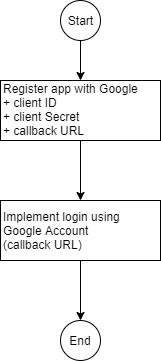

## Tạo Project trên Google API

Google OAuth client ID phải thuộc về một Project trên Google API.
Trước khi đăng ký OAuth client ID, ta cần tạo một Project trên Google APIs.

Ta cứ hiểu Project tương đương với một hệ thống của công ty, và ta đăng ký hệ thống đó với Google API (với quyền cho phép access vào data trong một scope nào đó), sau đó ta sẽ tạo các *client* cho phép accesss vào hệ thống này dưới các dạng web, iOS app, Android app, API...

Mở [Google API Console](https://console.developers.google.com/)

* Tạo project
  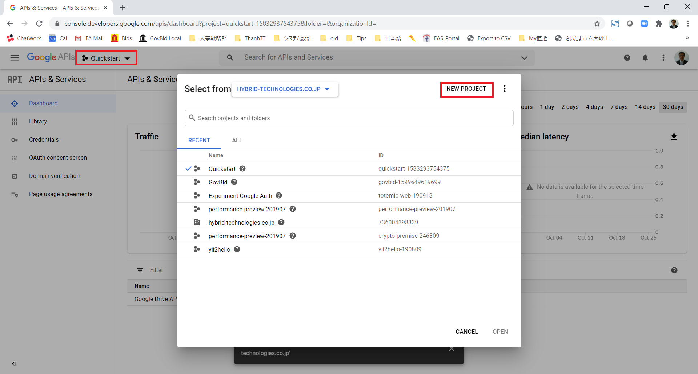
  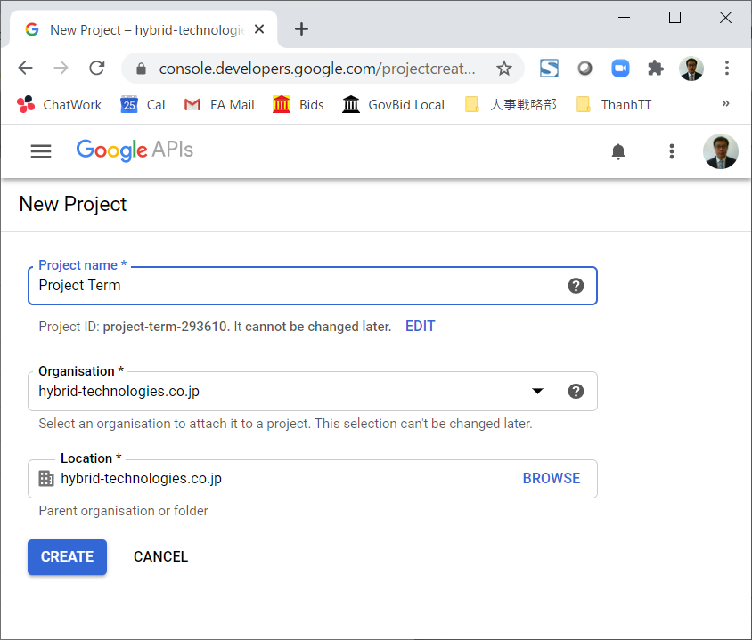

* Với project mới tạo, ta cần set OAuth consent screen cho nó.
  Có thể chọn User Type là *External* nếu muốn sử dụng địa chỉ gmail bất kỳ đăng nhập vào hệ thống (không giới hạn là địa chỉ gmail của công ty).
  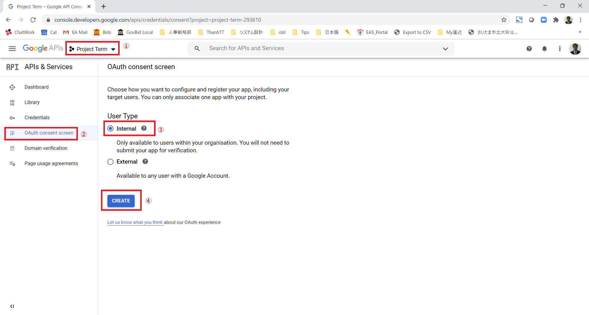
  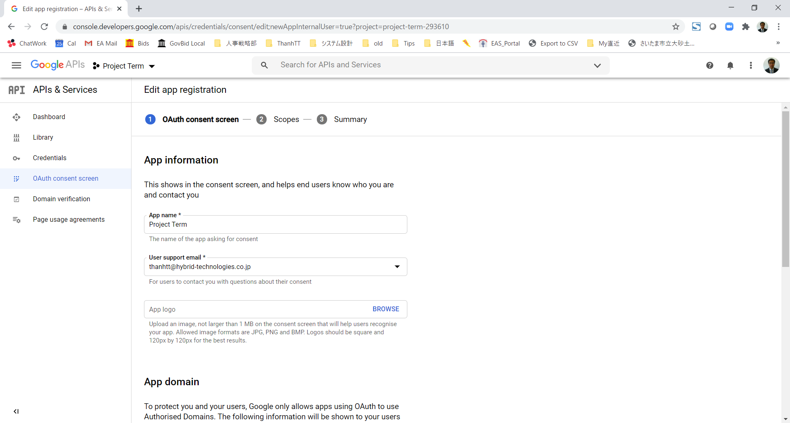


## Đăng ký client ID và client secret

Trên [Google API Console](https://console.developers.google.com/), chọn *Project Term*, đăng ký một OAuth client ID cho hệ thống của mình.
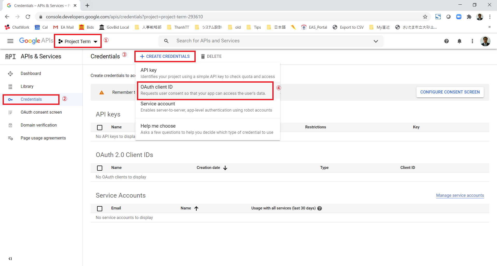

Điền các thông tin cần thiết để tạo OAuth Client ID
* Application type: Web application
* Name: Project Term dev
* Authorised JavaScript origins: http://localhost:18010
* Authorised redirect URIs: http://localhost:18010/index.php?r=site%2Fauth&authclient=google
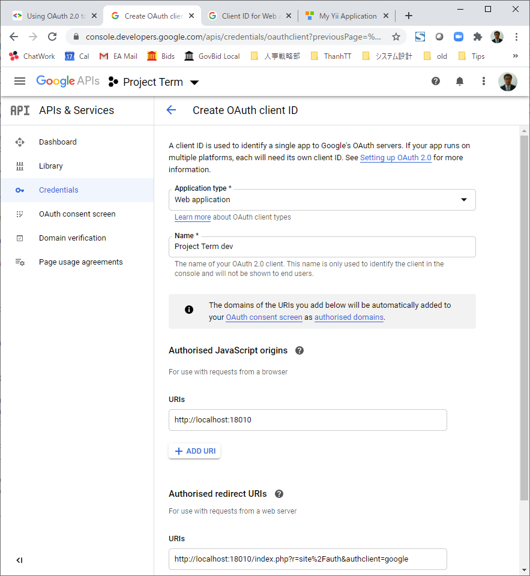

Sau khi tạo thành công, ta sẽ có client ID và client secret.
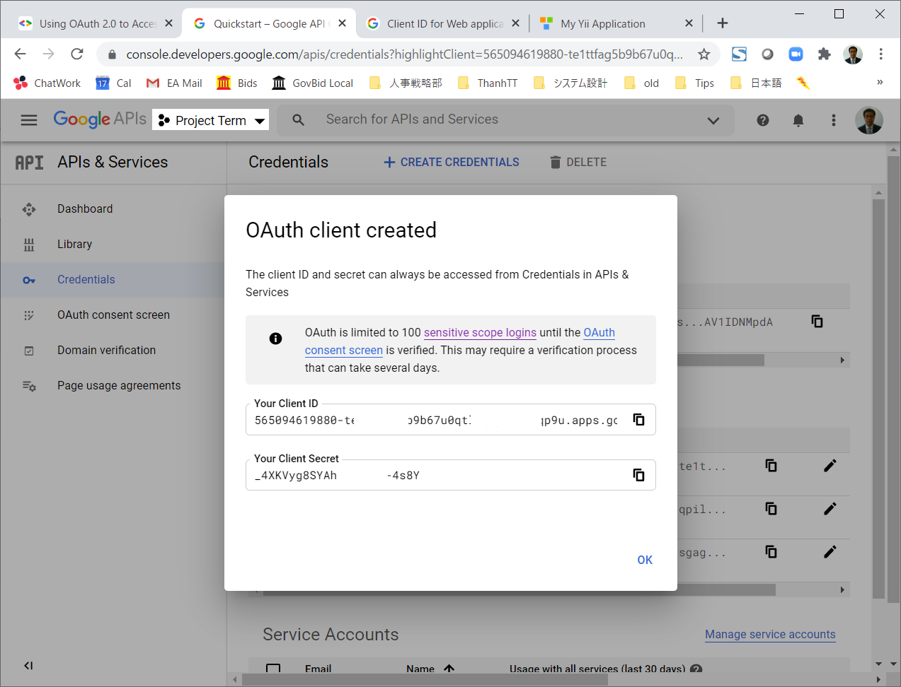

### Thêm thư viện yii2-authclient

Để cài đặt thư viện *yiisoft/yii2-authclient*
```shell
composer require yiisoft/yii2-authclient
```

Mọi người dùng lại file composer.json sau khi đã được cài đặt thư viện *yiisoft/yii2-authclient* và commit lên git thì chỉ chạy lệnh
```shell
composer install
```
thay vì lệnh `composer require` ở trên.

Xem giải thích về composer require/update/install [tại đây](https://github.com/umbalaconmeogia/yii2-batsg#explanation-about-composer-require-update-and-install)

## Config app

File *secret.php* của chúng ta có dạng như sau (chú ý, thông tin dưới đây chỉ là ví dụ, không thể sử dụng được)
```php
return [
    'authClientCollection' => [
        'class' => 'yii\authclient\Collection',
        'clients' => [
            'google' => [
                'class' => 'yii\authclient\clients\Google',
                'clientId' => '727778427125-ingmfnd0kpjshf6f9aamk1rrj94f3bnv.apps.googleusercontent.com',
                'clientSecret' => 'GMV0r8EiMHMy_3S4OZNATl18',
            ],
        ],
    ],
];
```

File *web.php* sẽ sử dụng thông tin trong secret.php và khai báo component để sử dụng Google account
```php
$secret = require __DIR__ . '/secret.php';

$config = [
    'components' => [
        'authClientCollection' => $secret['authClientCollection'],
        // Other stuffs.
    ],
    // Other stuffs.
];
```

## Tạo table auth

Để lưu thông tin liên quan đến login bằng Google, chúng ta cần chạy migration để tạo ra table *auth*

```shell
php yii migrate
```

## Implement callback

Flow màn hình login

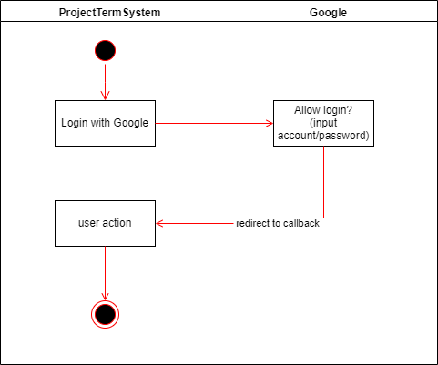

Router của callback là *site/auth* (theo khai báo khi tạo Google Client ID)

Ta có 2 phương pháp để định nghĩa một action trong controller
1. Tạo function action, ví dụ `public function actionIndex()`.
2. Khai báo trong `public function actions()`.

Trong trường hợp này, ta sẽ sử dụng khai báo trong function *actions()*.

```php
class SiteController extends Controller
{
    /**
     * {@inheritdoc}
     */
    public function actions()
    {
        return [
            'auth' => [
                'class' => 'yii\authclient\AuthAction',
                'successCallback' => [$this, 'onAuthSuccess'],
            ],
            // Other stuffs.
        ];
    }

    /**
     * Callback when "auth" success.
     * @param yii\authclient\ClientInterface $client
     */
    public function onAuthSuccess(ClientInterface $client)
    {
        (new AuthHandler($client))->handle();
    }
}
```

Sequence xử lý sau khi login thành công bằng Google account
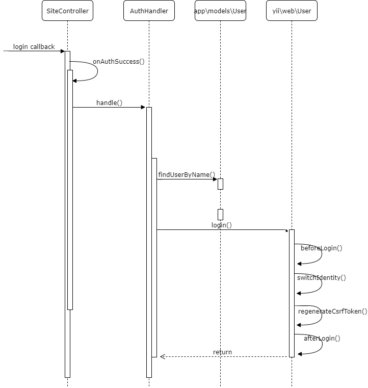

<details>
  <summary>So sánh với flow login bằng ID/password</summary>

  
</details>

## Thêm button login with google

Cuối cùng, thêm button login bằng Google vào màn hình login.
```php
    <h3><?= Yii::t('app', 'Login via Google') ?></h3>
    <?= yii\authclient\widgets\AuthChoice::widget([
        'baseAuthUrl' => ['site/auth'],
        'popupMode' => false,
    ]) ?>
```
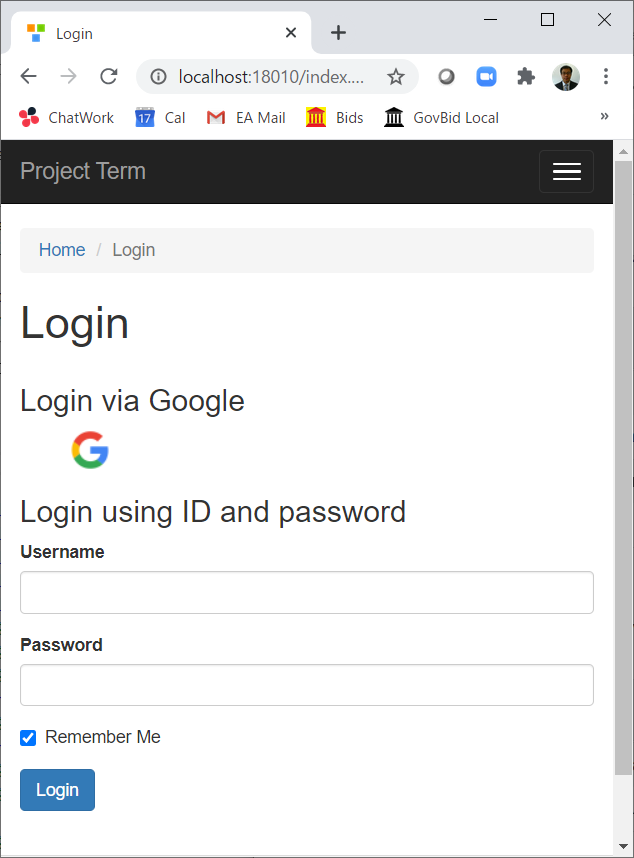

## Test

Đến đây thì hệ thống của chúng ta đã sẵn sàng để login vào bằng Google ID.

Hệ thống này không cho phép người dùng bên ngoài đăng ký user, mà chỉ cho phép user đã được đăng ký từ trước vào hệ thống (do admin hoặc từ command line).

Command line để tạo một user có dạng
```shell
php yii user/create-user <username> <email> <password>
```

Ta có thể lược bỏ thông tin password. Khi đó hệ thống sẽ tạo ra một random password (tất nhiên chúng ta không biết password này nên không thể dùng password này để login).

Để đăng ký user login bằng Google ID, ta dùng lệnh tương tự như sau, đăng ký username và email đều là địa chỉ Google email, và lược bỏ thông tin password.
```shell
php yii user/create-user example@gmail.com example@gmail.com
```
Chú ý, lệnh đăng ký user trên chính là lệnh đăng ký user bình thường trong hệ thống. Không có gì khác biệt giữa một user định login bằng ID/password và user login bằng Google ID. Chỉ là nếu username là Google ID, thì ta có thể login vào hệ thống thông qua Google ID, bên cạnh tính năng login bằng ID/password.