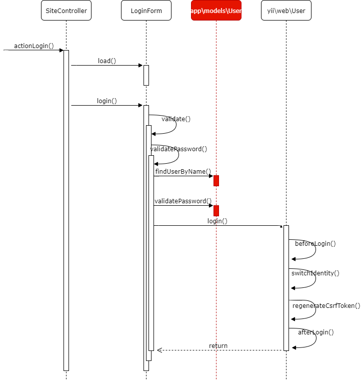

# Session và Cookies

Nội dung của bài hôm nay
* Tính năng login
* Authentication trong yii2
* Oauth2
* Token
* Một vài điều cơ bản về security của login
* Logout

## Tính năng login

Hầu như *hệ thống nào có tính năng edit data trên màn hình web cũng cần đến tính năng login*.
Vì nếu không có tính năng login thì ai cũng có thể access và edit data.

(Ví dụ về hệ thống không có tính năng edit data nên không cần login: Trang web toàn HTML tĩnh, mình tự edit file HTML và upload lên server bằng ftp hay ssh.)

Login dùng để *định danh* (authentication) người đang sử dụng hệ thống là một người đã được hệ thống nhận biết (đã đăng ký trong hệ thống). Người chưa được đăng ký và không có thông tin nhận biết thì không login được vào hệ thống.

Các phương pháp login rất đa dạng:
* Sử dụng ID và password.
* Sử dụng thẻ từ, USB.
* Sử dụng nhận diện khuôn mặt, vân tay, mạch máu, mống mắt.
* Sử dụng Open ID, OAuth (cái này đúng hơn là phương pháp kết nối, để login vào hệ thống sử dụng một hệ thống login khác)
* Sử dụng token (thường dùng cho API)

Việc thực nghiệm tất cả các phương pháp trên đều nằm trong tầm tay của chúng ta.
Với login trên hệ thống web cũng đều có thể áp dụng toàn bộ các phương pháp trên.

Hôm nay chúng ta tập trung vào 2 phương pháp cơ bản nhất là sử dụng ID/password và tính năng login của bên thứ 3.

Bản chất của việc login vào hệ thống web là:
* Sau khi định danh (authentication) được người dùng, thì lưu thông tin đó vào trong session.
* Trên browser thì lưu session ID đó vào cookie. Mỗi lần browser gửi request tới server thì gửi cookies đi kèm. Server sẽ kiểm tra xem trong cookies có session id không, session có hợp lệ (đã được tạo ra trên server sau khi login thành công) hay không. Nếu có thì request được xem là hợp lệ với một user nào đó đang login.

  Cho nên việc check xem có đang login hay không, ai là người đang login được thực hiện với *từng request*, chứ không phải là có một sự kết nối liên tục nào giữa browser và server để duy trì trạng thái login - mà ở bài trước chúng ta nói đến HTTP là stateless protocol

Liên quan đến định danh người dùng, chúng ta cần phân biệt 2 khái niệm authentication và authorization.
* Authentication: Để xác nhận một người là người dùng hệ thống (tức là đang login hay không).
* Authorization: Để kiểm tra việc một người (đã được authenticated) có quyền thực hiện một tính năng nào đó trên hệ thống hay không (ví dụ là người dùng bình thường, hay trưởng bộ phận, hay admin... thì có các quyền khác nhau trên hệ thống).

## Authentication trong yii2

Tài liệu tham khảo: [yii2 security authentication](https://www.yiiframework.com/doc/guide/2.0/en/security-authentication)

Vài chú ý:
* Ở đây sử dụng rất nhiều interface (chứ không phải là các class). Điều này định nghĩa ra *bộ khung* chuẩn cho vài loại flow xử lý login. Điều này giúp chúng ta không cần phải suy nghĩ về flow login, mà chỉ cần implement các class thực hiện việc này.
* Việc tạo ra các class dùng để login (chỉ cần chúng implement IdentityInterface là có thể dùng để login) cho phép developer có thể implement nhiều phương án login khác nhau (ID/pasword, hay login bằng token...).

### Kiến trúc class liên quan

### Login sequence

### Authentication sequence

## Logout