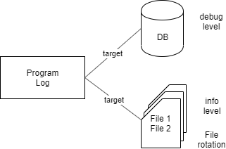

# Logging

## Overview

Tính năng log thật sự rất quan trọng, nhưng thường bị developer (cũng như SE) ít kinh nghiệm xem nhẹ.

Từ đó dẫn đến không có quy ước cụ thể về log trong design/coding convention. Từ đó dẫn đến mỗi developer log một kiểu, không biết lúc nào nên log hay không nên, log được lưu vào đâu, và được sử dụng cho những mục đích nào.

Những vấn đề hay gặp liên quan đến logn là
* Khi cần log để điều tra một issue gì đó, mới phát hiện ra là không có log.
* Không xây dựng chiến lược log cụ thể, nên không thiết lập filter cho đúng, dẫn đến khó sử dụng log.

Hiện nay các cloud service cũng cung cấp nhiều dịch vụ liên quan đến log, và người ta có xu hướng sử dụng tính năng đó khi dùng cloud service. Tuy nhiên trong khi code hệ thống, vẫn phải thực hiện việc log một cách đúng đắn.

Các vấn đề liên quan đến log chúng ta sẽ đề cập trong bài hôm nay
* Log config
* Log level: Xếp hạng từng log thuộc loại debug, info, warning hay error.
* Log target: Xuất log ra file hay DB, chia ra các file khác nhau.
* Log category
* Message filtering
* Logfile rotation
* Log interval
* Vài điều quan trọng với log



## Log config

Để sử dụng tính năng log có sẵn trong Yii, gọi hàm liên quan đến log như
```php
Yii::trace($message);
Yii::info($message);
Yii::warning($message);
Yii::error($message);
```
Trong Yii version mới, còn có `Yii::debug()`, có ý nghĩa tương tự `Yii::trace()`.

Các hàm `trace`, `info`, `warning`, `error` ở trên thực ra là các wrapper gọi tới hàm
`Yii::getLogger()->log()`.

Để sử dụng được các hàm log này, ta phải config để Yii biết được sẽ sử dụng logger nào (ta có thể dùng nhiều loại logger khác nhau, từ các logger class do Yii cung cấp sẵn cho tới các logger do người khác - hoặc tự mình - viết).

Config cơ bản nhất của logger là
```php
'components' => [
    'log' => [
        'targets' => [
            [
                'class' => 'yii\log\FileTarget',
                'levels' => ['error', 'warning', 'info', 'trace'],
            ],
        ],
    ],
],
```
(nếu ta không config log component, thì sẽ không có dòng log nào được xuất ra cả)

Với config này, log sẽ được xuất ra file `runtime/logs/app.log`, với tất cả các loại log level.

Ví dụ về log.
Trong class `SampleController`, ta tạo `actionLog()`
```php
public function actionLog()
{
    Yii::debug('This is debug log');
    Yii::trace('This is trace log');
    Yii::info('This is info log');
    Yii::warning('This is warning log');
    Yii::error('This is error log');

    return $this->renderContent("Log is witten to file");
}
```
Access vào http://localhost:18010/?r=sample/log , file `runtime/logs/app.log` sẽ có kết quả như sau:
```log
2020-11-08 14:08:18 [172.19.0.1][1][-][trace][application] This is debug log
2020-11-08 14:08:18 [172.19.0.1][1][-][trace][application] This is trace log
2020-11-08 14:08:18 [172.19.0.1][1][-][info][application] This is info log
2020-11-08 14:08:18 [172.19.0.1][1][-][warning][application] This is warning log
2020-11-08 14:08:18 [172.19.0.1][1][-][error][application] This is error log
```
Chú ý là bản thân logger class `FileTarget` có rất nhiều thiết lập mặc định (ví dụ như xuất ra file runtime/logs/app.log), trong file config, chúng ta chỉ chỉ định những thiết lập nào khác với giá trị mặc định thôi.

## Log level

Có các log level
| Level | Giải thích |
|---|---|
| trace | Xuất ra những thông tin không quan trọng, chủ yếu để follow được tình trạng chương trình đã chạy tới đâu. Thường dùng với mục đích debug, ví dụ như các message debug, câu lệnh SQL... |
| info | Những thông tin log được cho rằng quan trọng, ví dụ như nhận hoặc gửi thông tin với hệ thống thứ 3, hay hệ thống đã chạy đến step nào... |
| warning | Hệ thống có vấn đề đáng lưu ý, ví dụ như module nào bị chặn access (nhưng không gây ra lỗi) |
| error | Bắt được lỗi xảy ra |

Chú ý là các log level ở đây chỉ được đánh dấu như là thuộc tính của dòng log, để tiện cho các chương trình monitoring trạng thái dễ nhận biết tình trạng của dòng log như ví dụ dưới đây, chứ không mang ý nghĩa gì đặc biệt. Việc xử lý trạng thái đó thế nào là việc của các chương trình theo dõi log, hay người quyết định xử lý log.
```log
2020-11-08 14:08:18 [172.19.0.1][1][-][trace][application] This is debug log
2020-11-08 14:08:18 [172.19.0.1][1][-][trace][application] This is trace log
2020-11-08 14:08:18 [172.19.0.1][1][-][info][application] This is info log
2020-11-08 14:08:18 [172.19.0.1][1][-][warning][application] This is warning log
2020-11-08 14:08:18 [172.19.0.1][1][-][error][application] This is error log
```
Nếu developer viết lệnh log sai, thì hoàn toàn có khả năng là một dòng log để debug (trace) nhưng lại được đánh dấu là error.

## Log target

Sử dụng cac class có sẵn của Yii, log có thể được xuất ra file, DB, email, syslog.

Cùng một dòng log cũng có thể được ghi vào nhiều target khác nhau, thậm chí nhiều file khác nhau (tùy thuộc vào config)

Ví dụ config dưới đây cho phép xuất cùng nội dung log vào cả file và DB.
```php
'components' => [
    'log' => [
        'targets' => [
            [
                'class' => 'yii\log\FileTarget',
                'levels' => ['error', 'warning', 'info', 'trace'],
            ],
            [
                'class' => 'yii\log\DbTarget',
                'levels' => ['error', 'warning', 'info', 'trace'],
            ],
        ],
    ],
],
```

Ta có thể config các chế độ filter để xuất các nội dung log vào từng target riêng biệt (sẽ giải thích ở phần sau).

TBD: Demo DB target.

## Log category

Các hàm xuất log có tham số category mặc định là "application".
Ví dụ khai báo của hàm `info` như sau
```php
info($message, $category = 'application')
```
Output với category mặc định như sau:
```log
2020-11-08 14:08:18 [172.19.0.1][1][-][trace][application] This is debug log
2020-11-08 14:08:18 [172.19.0.1][1][-][trace][application] This is trace log
2020-11-08 14:08:18 [172.19.0.1][1][-][info][application] This is info log
2020-11-08 14:08:18 [172.19.0.1][1][-][warning][application] This is warning log
2020-11-08 14:08:18 [172.19.0.1][1][-][error][application] This is error log
```
Giá trị category mặc định "application" không có tác dụng gì mấy (nó thường mang ý nghĩa log này do chương trình chúng ta viết ra, mà không phải là của thư viện nào khác - hoặc là log của thư viện nhưng developer viết thư viện đó "lười biếng" không xuất log cho đúng điệu :D). Thường chúng ta hay đặt tên function nơi gọi hàm xuất log, để biết log này được xuất ra từ đâu. Để làm được điều này, thì hàm log được gọi với category là `__METHOD__`. Ví dụ:
```php
Yii::debug('This is debug log', __METHOD__);
Yii::trace('This is trace log', __METHOD__);
Yii::info('This is info log', __METHOD__);
Yii::warning('This is warning log', __METHOD__);
Yii::error('This is error log', __METHOD__);
```
sẽ cho ra output
```log
2020-11-08 16:08:32 [172.19.0.1][1][-][trace][app\controllers\SampleController::actionLog] This is debug log
2020-11-08 16:08:32 [172.19.0.1][1][-][trace][app\controllers\SampleController::actionLog] This is trace log
2020-11-08 16:08:32 [172.19.0.1][1][-][info][app\controllers\SampleController::actionLog] This is info log
2020-11-08 16:08:32 [172.19.0.1][1][-][warning][app\controllers\SampleController::actionLog] This is warning log
2020-11-08 16:08:32 [172.19.0.1][1][-][error][app\controllers\SampleController::actionLog] This is error log
```
Chỉ định category sẽ giúp ta filter được các message (xem phần sau).

## Message filtering

Chúng ta sử dụng message filtering trong log config để
* Phân luồng log vào các target khác nhau.
* Chỉ định log level cho mỗi target.

Ví dụ dưới đây sẽ
* Xuất log của SQL (đúng hơn là log của thư viện `yii\db`) vào file `runtime/logs/sql.log`.
* Xuất các log không thuộc thư viện `yii\db` vào file `runtime/logs/app.log`.
```php
'components' => [
    'log' => [
        'targets' => [
            [
                'class' => 'yii\log\FileTarget',
                'levels' => ['error', 'warning', 'info', 'trace'],
                'logVars' => [],
                'except' => ['yii\db\*'], // Trừ các log có category là yii\db\*
            ],
            [
                'class' => 'yii\log\FileTarget',
                'levels' => ['error', 'warning', 'info', 'trace'],
                'logVars' => [],
                'categories' => ['yii\db\*'], // Chỉ các log có category là yii\db\*
                'logFile' => '@app/runtime/logs/sql.log', // Tên file log là sql.log
            ],
        ],
    ],
],
```
Với config trên, bên cạnh nội dung xuất ra file `app.log`, ta còn có file `sql.log` với nội dung như sau:
```sql
2020-11-08 16:17:03 [172.19.0.1][1][-][info][yii\db\Command::query] SELECT * FROM "system_user" WHERE "id"=1
2020-11-08 16:17:03 [172.19.0.1][1][-][info][yii\db\Connection::open] Opening DB connection: pgsql:host=project_term_sql;dbname=project_term
2020-11-08 16:17:04 [172.19.0.1][1][-][info][yii\db\Command::query] SELECT COUNT(*) FROM "project"
2020-11-08 16:17:04 [172.19.0.1][1][-][info][yii\db\Command::query] SELECT * FROM "project" LIMIT 20
```

## Logfile rotation

Khi dung lượng file log quá lớn, thì việc xuất ra file sẽ làm chậm chương trình. Để tránh việc này, ta sẽ thiết lập để khi log file đạt đến dung lượng nào đó, thì nó sẽ chuyển sang file mới. Các file log sẽ được đặt tên kiểu như `app.log`, `app.log.1`, `app.log.2`...

Ngoài ra, để tiện theo dõi thì mỗi ngày, chúng ta cũng cho chuyển sang file log mới, và gắn ngày đó vào tên file log. Ví dụ
```
20200622_app.log
20200622_app.log.1
20200622_app.log.2
20200622_app.log.3
20200622_app.log.4
20200622_sql.log
20200622_sql.log.1
20200622_sql.log.2
20200622_sql.log.3
20200622_sql.log.4
```

Config như sau:
```php
'components' => [
    'log' => [
        'targets' => [
            [
                'class' => 'yii\log\FileTarget',
                'levels' => ['error', 'warning', 'info', 'trace'],
                'logVars' => [],
                'except' => ['yii\db\*'],
                'maxLogFiles' => 50,
                'logFile' => '@app/runtime/logs/' . date('Ymd') . '_app.log',
            ],
            [
                'class' => 'yii\log\FileTarget',
                'levels' => ['error', 'warning', 'info', 'trace'],
                'logVars' => [],
                'categories' => ['yii\db\*'],
                'maxLogFiles' => 50,
                'logFile' => '@app/runtime/logs/' . date('Ymd') . '_sql.log',
            ],
        ],
    ],
],
```

## Log interval

Để tránh việc xuất log làm giảm hiệu xuất chương trình, không phải mỗi lệnh xuất log sẽ làm thư viện log ghi log ra target (file/DB). Thư viện log sẽ tích lũy log trong memory và chỉ xuất ra khi đạt được một số lượng log nào đó (cái này cũng có thể thiết lập trong config).

Tuy nhiên, nếu chương trình có lỗi, bị crash thì ngược lại, log trong memory đó sẽ không kịp được đẩy ra target, dẫn đến ta không có thông tin để debug.

Trong trường hợp gặp lỗi khiến chương trình bị crash mà không lấy được log để điều tra, thì ta có thể thiết lập trong config để thư viện log đẩy ngay nội dung log ra target.

Tham khảo [Message Flushing and Exporting](https://www.yiiframework.com/doc/guide/2.0/en/runtime-logging#flushing-exporting)

## Vài điều quan trọng với log

Có kế hoạch/chiến lược sử dụng log là rất quan trọng. Nếu không thì việc xuất log (trong chương trình) sẽ không có tác dụng thực tế (có thể làm ảnh hưởng đến performance của hệ thống, hoặc không có đầy đủ log khi cần điều tra hay theo dõi hệ thống).

Các kinh nghiệm thường áp dụng với log là
* Tách log SQL ra khỏi log chương trình.
* Cần thiết lập log để lưu lại đầy đủ log, tránh bị ghi đè, mất log.
  Ví dụ như log rotation theo file size, theo ngày. Có cơ chế backup log.
* Khi bắt lỗi exception, cần phải xuất được ra log.
* Về log level: Khi hệ thống mới vận hành, thì trên môi trường production cho xuất log ra với mọi level (cả level trace/debug). Khi hệ thống đã chạy được một thời gian ổn định, số lượng user/xử lý tăng lên thì không cho xuất log level debug nữa, chỉ xuất log level info, warning, error.
* Nếu hệ thống nhận data từ hệ thống khác (ví dụ access vào API của hệ thống khác, hoặc nhận data ở dạng webhook), hoặc xuất data ra cho hệ thống  khác (cung cấp API cho bên ngoài) thì phải lưu log lại data vào/ra này ở nguyên dạng của nó (raw data), không được sửa đổi gì. Như thế mới có tác dụng debug khi gặp vấn đề.
  Ví dụ khi nhận được một chuỗi data json, thì phải lưu nguyên chuỗi này vào log, chứ không phải lưu log sau khi đã convert nó thành json object.

Trong bài này, chủ yếu chúng ta đề cập đến application log (log do chương trình viết ra). Tuy nhiên trong hệ thống còn có các loại log khác mà chúng ta cần đề cập đến khi thiết kế hệ thống.
* Web server log
* Database server log
* Log của các middleware khác (như message queue...)
Tất cả các log này đều cần được backup lại đầy đủ (thường thì hệ thống sẽ có yêu cầu phải backup log từ 3-5 năm).

## Reference

[Logging in Yii2 Guide](https://www.yiiframework.com/doc/guide/2.0/en/runtime-logging)