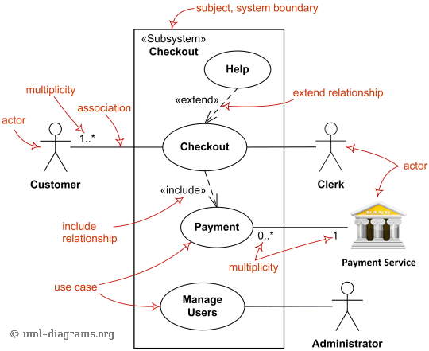

# Use cases diagram

## Overview

Use cases diagram dùng để mô tả về business, hoặc hệ thống. Nó diễn tả những đối tượng (actor: người, công ty, hệ thống ngoài) sử dụng business/hệ thống như thế nào (có những tính năng gì cung cấp cho actor đó, các chức năng đó có sự liên kết với nhau thế nào...).

Use cases diagram thường được dùng để
* Mô tả nghiệp vụ: Người tham gia vào nghiệp vụ này là ai, về cơ bản thì nghiệp vụ gồm những tính năng gì.
* Mô tả tổng quan tính năng mà hệ thống IT cung cấp: Hệ thống cung cấp tính năng gì, có những loại người dùng nào (và họ được phép sử dụng tính năng nào), liên kết với hệ thống ngoài nào.

Vài điểm nên nhớ
* Quan hệ <<include>> mang tính bắt buộc.
* Quan hệ <<extend>> không mang tính bắt buộc.

## Ví dụ

### UCD dùng để mô tả nghiệp vụ

Khi chúng ta làm Requirement Definition, sẽ phải tìm hiểu (hearing) nghiệp vụ của khách hàng và chỉnh lý lại nó. UCD có thể dùng trong trường hợp này để vẽ tổng quan về nghiệp vụ.

UCD này giải thích về nghiệp vụ check in ở sân bay. Từ UCD này ta có thể đọc ra
* Check-in ở sân bay có các thao tác (case) là
  * Group Check-in: Check in cả đoàn.
  * Individual Check-in: Check in cá nhân.
  * Baggage Check-in: Gửi hành lý.
  * Security Screening: Kiểm tra security từng cá nhân.
* Passenger (người lên máy bay) phải làm thủ tục check-in cá nhân (Individual Check-in). Đại khái là đưa passport ra, kết quả là nhận về vé máy bay.
* Khi làm thủ tục check-in cá nhân, nếu có hành lý ký gửi, thì ta phải làm thủ tục Gửi hành lý (Baggage Check-in). Nếu không có hành lý ký gửi thì không cần làm. Cho nên case này là KHÔNG BẮT BUỘC khi check-in cá nhân, nó có quan hệ kiểu <<extend>> với check-in cá nhân.
* Passenger có làm thủ tục kiểm tra security từng cá nhân (đi qua máy soi người).
* Nếu đi theo đoàn và có Tour Guide, thì tour guide có thể làm thủ tục Group Check-in (kiểu như anh ấy dẫn cả đoàn chạy tới Check-in counter, bảo em gái xinh đẹp là "Cho đoàn anh làm thủ tục").
  * Khi Tour Guide làm thủ tục Group Check-in, thì vẫn bắt buộc phải làm thủ tục Individual Check-in cho từng thành viên trong đoàn (chường mặt ra cho em gái quầy checkin em ý nghía).
  * Bản thân Tour Guide cũng là một Passenger, nên anh ấy cũng phải làm thủ tục như của Passeenger (Tour Guide *kế thừa* (generalize) các đặc tính của Passenger).

### UCD dùng để mô tả hệ thống

Ở phần đầu của Basic Design, chúng ta dùng UCD để mô tả tổng quan về các tính năng của hệ thống, những người sử dụng hệ thống, và sự liên kết với hệ thống ngoài (đây cũng có thể xem như là người sử dụng hệ thống).

UCD này giải thích về tính năng checkout khách sạn trên hệ thống. Từ UCD này có thể đọc ra.
* Khách hàng (Customer) sử dụng tính năng Checkout.
* Nếu cần trợ giúp, thì có thể sử dụng tính năng Help khi Checkout (không bắt buộc, cho nên nó là <<extend>>).
* Tiếp tân (Cleck) cũng có thể làm thủ tục Checkout cho khác.
* Khi checkout, thì phải thanh toán tiền (Payment).
* Chức năng thanh toán này (thường là Credit Card) sẽ kết nối với dịch vụ thanh toán Payment Service của bên thứ 3.
* Hệ thống có các user (Customer, Cleck). Administrator có thể "Manager User".

### UCD mô tả tính năng hệ thống "quản lý thuật ngữ chuyên môn của dự án outsourcing"

    
Khái niệm về hệ thống

    Công ty HyTech (gọi tắt là HT) là công ty chuyên làm outsourcing trong lĩnh vực phát triển phần mềm cho các khách hàng nước ngoài. Các khách hàng của công ty nằm ở nhiều nơi trên thế giới, sử dụng nhiều ngôn ngữ khác nhau như tiếng Anh, Nhật...

    Các tài liệu nhận từ phía khách hàng thường là tiếng nước ngoài, trong đó có nhiều từ chuyên môn có ý nghĩa đặc biệt khác với nghĩa thông thường, mà ngay cả người nước sở tại, nếu không được giải thích cũng sẽ không hiểu chính xác. Điều này sẽ gây khó khăn cho đội ngũ BrSE và Comtor trong việc hiểu và dịch đúng nội dung tài liệu dự án.

    Để giải quyết vấn đề này, các dự án thường lập danh sách từ vựng trong đó giải thích nghĩa của từ chuyên môn. Danh sách này thường được lưu trong tài liệu dự án, dưới dạng file Word hoặc Excel.

    Tuy nhiên quản lý từ vựng theo file khiến việc tham khảo thông tin từ vựng không được tiện lợi, không phản ánh kịp thời khi danh sách có sự cập nhật (mất tính realtime). Việc quản lý danh sách ở nhiều nơi, nhiều hình dạng cũng khiến cho các dự án không dược kế thừa và chia sẻ những kiến thức chung (ví dụ, các dự án trong cùng một ngành sẽ chia sẻ chung nhiều thuật ngữ chuyên môn).

    "Hệ thống quản lý từ vựng cho các dự án outsourcing" (gọi tắt là VocabularySystem) này ra đời để giúp cho việc lưu trữ, truy xuất và chia sẻ các từ vựng chuyên môn trong các dự án trong công ty được hiệu quả hơn.

    
Giải thích UCD

    * Hệ thống có người sử dụng là member của dự án (ngoài member bình thường, còn có Comtor, BrSE).
    * Member của dự án, có thể tra cứu thuật ngữ chuyên môn của dự án.
    * Comtor có thể thêm bất kỳ thuật ngữ chuyên môn nào vào dự án, và dịch nghĩa nó.
    * BrSE sẽ đăng ký danh sách thuật ngữ chuyên môn nhận từ khách hàng vào dự án.
    * Administrator cũng là một người dùng hệ thống, có nhiệm vụ đăng ký người dùng hệ thống, đăng ký dự án, member dự án.

## References

* [UML Use Case Diagrams](https://www.uml-diagrams.org/use-case-diagrams.html)
* [Tìm hiểu về Use Case](https://viblo.asia/p/tim-hieu-ve-use-case-DbmvmLAXkAg)